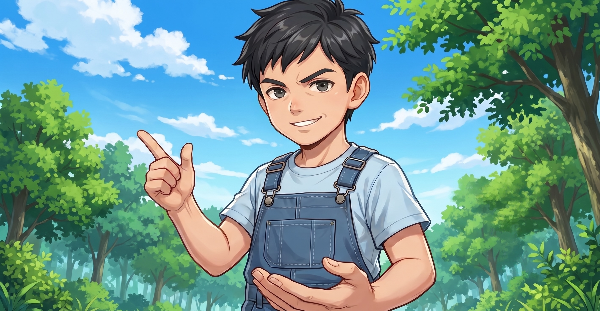
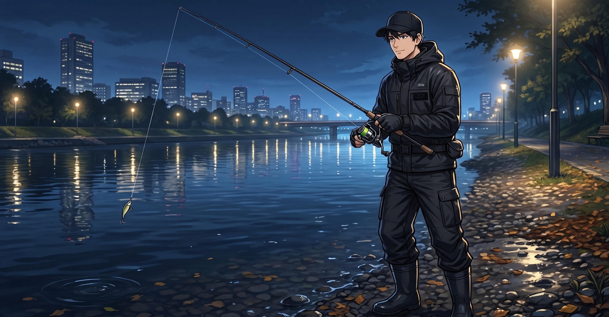
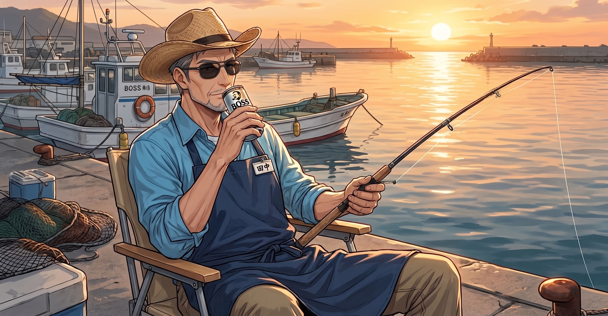

# 道具は裏切らない｜田中店長、釣り歴35年を語る

## 最初の一匹は、父親が釣らせてくれたのかもしれない

——釣り歴35年、長いですね。おいくつの頃から？

5歳です。親父に連れられて近所の川でフナを釣ったのが最初で、そのときのことはほとんど覚えていないんですが、釣れたときに親父がすごく喜んでいたのは覚えています。自分が釣ったのか親父が釣らせてくれたのかも、正直怪しい。

——お父さんが師匠なんですね。

川釣りの師匠ですね。中学くらいまでは川ばっかりで、フナ、タナゴ、たまにナマズ。のべ竿一本でずっと遊んでいました。今でも親父は川派です。

---

## アジの入れ食いで、川には戻れなくなった

——海釣りはいつから？

高校生のときに友達に連れられて堤防に行って、そこでアジが入れ食いになりまして。あの日から川には戻れなくなりました。親父には「裏切り者」と言われましたね。

——サビキ釣りですよね。

そうですそうです。最初はコマセの臭いが無理で、友達にやってもらってたんですけど、釣れ始めたら自分でやりますよね。人間そんなもんです。

---

## ルアーにハマり、タックルだけ増えていく二十代

——その後はどんな釣りを？

ルアーに行きました。雑誌でシーバスの記事を読んで、夜の街で大物が釣れるというのがカッコよく見えて。実際やってみたら全然釣れなくて、半年ぐらいボウズ続きでした。でも不思議と辞めなかったですね。ルアーって釣れなくても投げてるだけで楽しいんですよ、あれ。

——分かります。頭を使いますし。

二十代はショアジギングとエギングにもハマりました。とにかく新しい釣りが出てくるたびに手を出すタイプで、タックルだけ増えていくやつです。

——相当お金使いましたね。

笑えない金額ですよ、本当に。ショアジギはロッドだけで何本買ったか。「飛距離が足りない」「もう少し柔らかい方がいい」って言い訳しながら増やしていくんですよね。エギングも同じで、エギのカラーを揃え始めたら止まらなくなって。ケースが一個、二個、気づいたら専用の引き出しができていました。

当時付き合っていた彼女には「釣り道具にそんなにお金使うなら結婚できない」と言われましたね。別れましたけど、道具は残っています。今思うと正しい選択をしたと思います。**道具は裏切らないので。**

——それは名言ですね。

まあそういう経験があるから、お客さんに「これ全部必要ですか」って聞かれたとき、正直に答えられるんですよ。必要なものと欲しいものは違うって、身をもって知っていますから。

---

## 釣りとは何か

——人生そのものが釣りでできているような店長ですが、釣りとは何ですか？

……難しいこと聞きますね。待ってください、ちゃんと考えます。

…………

「言い訳のできる暇つぶし」ですかね。

釣れなくても「潮が悪かった」「風が強かった」「前日に雨が降った」って言えるじゃないですか。これだけ言い訳が用意されている趣味って他にないと思うんですよ。ゴルフのスコアが悪くても潮のせいにはできないですから。

——真面目に言うと？

釣りって「待つこと」なんですよね。魚が来るかどうか分からない時間をただ過ごす。その間に色々考えたり、何も考えなかったり。そういう時間が現代人には案外必要なんじゃないかと思っていて。彼女と別れたことも、釣り場でぼんやりしながら整理しましたし。

だから釣りは私にとって「考える場所」でもあります。魚が釣れればなお良し、という感じで。

---

*田中店長のコラムは[こちら](https://tsuricast.jp/articles/)から。*
