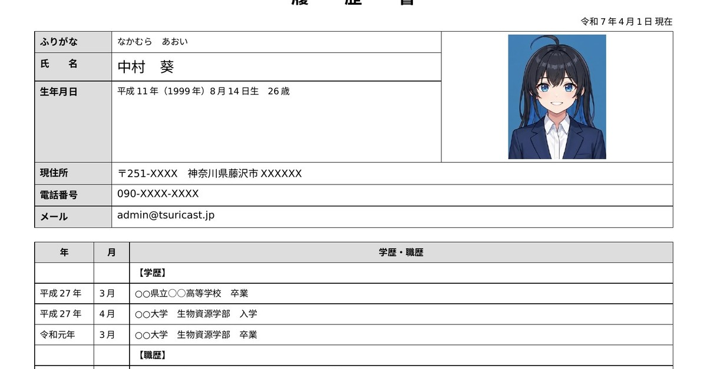
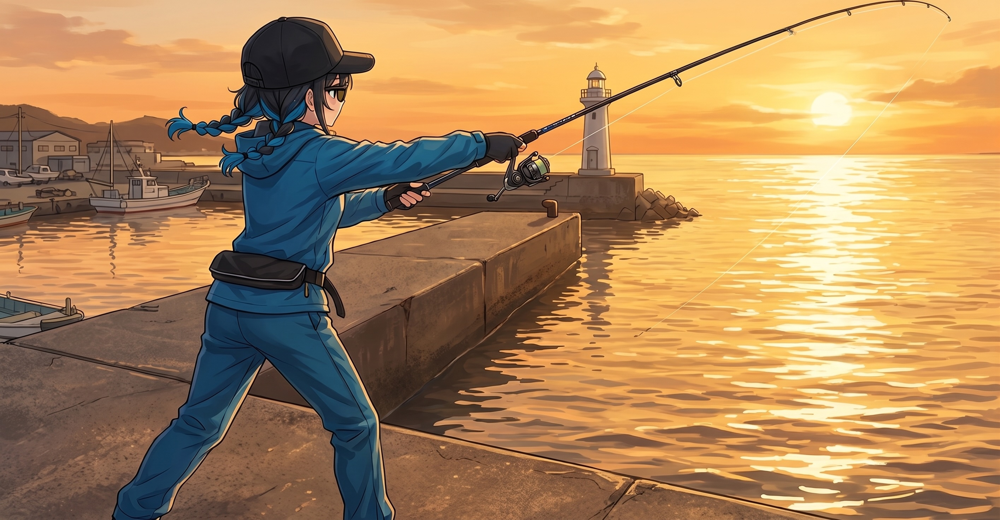
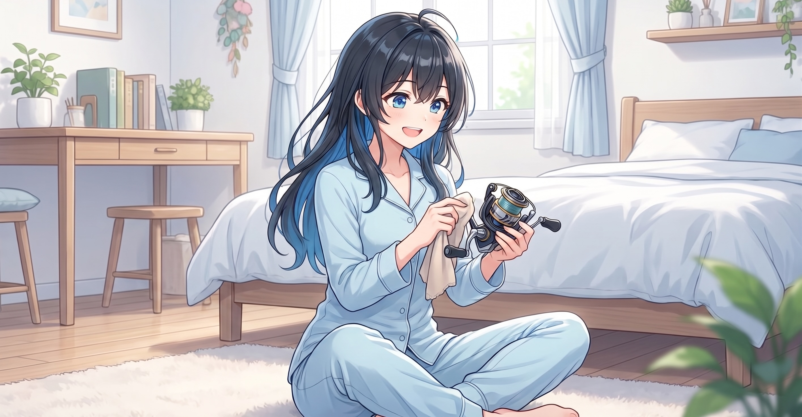

<<<<<<< HEAD
---
title: 釣りは「仮説を立てて、答え合わせをしに行く場所」｜スタッフ・中村葵インタビュー
description: タックルガイドを担当するスタッフ・中村葵へのインタビュー。釣具店での接客経験、エギングとの出会い、記事の書き方へのこだわり、そして「釣りとは何か」を語ってもらった。
updated: 2026-04-27
---

=======
>>>>>>> 611372e12a4017a386f62ff2648b410fe3337412
# 釣りは「仮説を立てて、答え合わせをしに行く場所」｜スタッフ・中村葵インタビュー

Tsuricastのタックルガイドを一手に担うスタッフ、中村葵さん。釣具店での接客経験を活かしながら、日々記事を書き続ける26歳に話を聞いた。

---

## 履歴書、サイトに貼ってしまいました

——自己紹介ページに「履歴書」が貼られていて、少し驚きました。

ありがとうございます。あれ、自分で書いといてちょっと恥ずかしいんですよね。普通履歴書ってサイトに貼らないじゃないですか。田中店長に「自己紹介ページを作れ」って言われて、何を書けばいいか分からなくて、結局履歴書を貼ったらそのまま通ってしまいました。

---

## 釣りとの出会い

——釣り歴6年ということは、大学在学中に始められたのですか？

そうです、大学2年か3年のときだったと思います。きっかけは……正直に言うと、誰かに連れて行ってもらったんですよね。詳しくは聞かないでください（笑）。

ただ、連れて行ってもらったのはきっかけで、続けたのは自分の意志です。最初にエギングをやらせてもらったんですが、アオリイカが乗った瞬間の引きが面白くて。生物資源学部だったので海や生き物への親しみはもともとあって、そこにうまくはまった感じです。

——最初にエギングという時点で、かなりガチな入り方ですね。

釣具店で働き始めてから「最初にエギングはなかなかですね」って何回か言われました。自分では普通だと思ってたんですが（笑）。

---

## エギングからちょい投げ、そして投げ釣りへ

——今でもエギングはされているようですが、他のジャンルは？

サビキとちょい投げをよくやります。サビキはアジが入れ食いになるときの気持ちよさがあって、ちょい投げはお手軽に始められるのが好きです。あと最近、投げ釣りが少し気になっています。うちの先輩がシロギス一筋で、話を聞いてるうちに興味が出てきて。まだ未経験なんですけど、近いうちに挑戦したいと思っています。

——投げ釣りは、ルアーとは次元の違う爽快感がありますよ。やるとハマると思います。

先輩を見てるとそれは伝わってきます。「歩いて投げて当たったら巻くだけ」って言うんですけど、その言い方が逆にすごく楽しそうで。先週、先輩が三浦海岸でシロギスを17尾釣ってきて。しかもETC忘れて行き先変更した結果の17尾なんですよ。そういう人なんです、うちの先輩（笑）。その話を聞いてたら余計に行きたくなってしまって、昨日一人で三浦海岸に行ってきたんですが……天秤と仕掛けだけ買って行ったわりには、まあそれなりに楽しめました。釣果は聞かないでください（笑）。

---

## ソロ釣行と、おじさんのタックルチェック問題

——釣りはソロで行かれることが多いですか？

メインはソロです。自分のペースで動けるのが好きで。潮回りとか海況を見て「今日ここ」って決めたら、さっさと行きたいタイプなので。

ただ田中店長に入社3ヶ月くらいのとき、「たまには現場を見なさい」って早朝の堤防に連れ出されたことがあって。午前4時半集合で、わたし前夜2時間しか寝られなかったんですけど、店長は5分前に普通の顔で現れて「眠そうだね」って一言だけ（笑）。その日は店長が青物2本、わたしはフグ1匹でした。帰りのコンビニで「フグも釣れたじゃないですか」ってフォローされたんですけど、全然フォローになってなかったです。でも悪い気はしなかったですね、なんか。

——女性のソロのエギンガーって、釣り場でなかなか出会わないですよね。おじさんとかに声かけられませんか？

かけられます（笑）。エギングって堤防の端っこで黙々とシャクってる釣りなので、話しかけてくる方がいると正直ちょっと集中が途切れるんですよね。

ただ、悪い人はほとんどいなくて。「釣れてる？」って聞いてきて、少し話して、じゃあお互い頑張りましょうって感じで終わることが多いです。釣り場ってそういう空気があって、それは好きです。たまに「女の子がエギングやるの珍しいね」って言われるんですけど、釣具店で働いてるって言うとだいたい納得してもらえます（笑）。あと道具見られて「ちゃんとしたタックルだね」って言われると、店員としてちょっと嬉しいですね。

——あーいますね。人のタックルチェックして「ふーん、いいね」とか言う人。

あれ最初は何なんだろうって思ったんですけど、釣具店で働いてから分かるようになりました。道具好きな人って、道具の話がしたくてしょうがないんですよね。釣りより道具の話が好きなんじゃないかって人、お客さんにも結構いらっしゃいます。

ただタックルチェックしてくる人って、たいてい自分のタックルの話をしたいだけなので（笑）、「いいですね」って返したら次は向こうの装備の話が始まるんですよ。それが分かってからは、むしろ話しかけてもらったら「何使ってるんですか」って先に聞くようにしてます。釣具店の接客と同じですね、結局。

---

## 接客の経験が記事に生きている

——普段の仕事について聞かせてください。釣具店の業務では何をされているのですか？

基本的には普通のアルバイトスタッフと同じで、レジとか品出しとか棚整理とかです。あとお客さんへの接客ですね。

特に「釣りを始めたばかりで何を買えばいいか分からない」って方への対応は好きで。道具って選択肢が多すぎて最初は本当に分からないじゃないですか。そういう方に話を聞きながら、必要なものを一緒に絞っていくのが楽しいんですよね。

あと田中店長の蘊蓄から逃げるのも重要な業務です（笑）。「○○のリール迷ってるんですよね」って相談すると、スマホを置いてシャキッとして、そこから30分は確実に帰ってこれないので。聞きたいときは時間に余裕があるときだけって決めてます。

——接客の経験は、サイト運営や記事作成に活かされていますか？

直結してると思います。接客って結局、目の前の人が「何に困っているか」を聞き出す作業じゃないですか。「リールが欲しい」って言葉の裏に、「どんな釣りがしたいか」「予算はどのくらいか」「どこで釣るか」が隠れていて、それを引き出してから提案する。

記事を書くときも同じ感覚で書いています。「リールの選び方」って検索してくる人が本当に知りたいのは、型番の羅列じゃなくて「自分の釣りにはどれが合うか」ですよね。だからスペックを並べるより「こういう釣りをしたい人はこっち」という書き方を意識しています。

ただ接客と違うのは、目の前に人がいないので「分かりましたか？」って確認できないところで。読んだ人がどう感じたか分からないのが、記事を書いていて一番もどかしいところです。

——シマノとダイワのスピニングリールの型番の解説とか、伝わったかどうか不安になりますよね（笑）。

あれは書きながら自分でも不安でした（笑）。シマノのCとダイワのCで意味が逆って、文字にしても「本当に伝わってるかな」って。だから「C3000SDHHGを解読すると」って実際の型番を一個拾って分解して見せたりしました。我ながらあの実例解説は親切だったと思ってるんですけど、どうでしょう（笑）。

お客さんに説明するときも、あの型番の話は毎回ちょっと緊張します。説明し終わった後に「で、結局どれ買えばいいんですか」って言われると、あ、伝わってなかったなって（笑）。でもそれが正直な反応だと思うので、最後は「この釣りがしたいならこれ一択です」って一本に絞って終わるようにしてます。

——ダイワの低価格帯リールのドラグ機構についての記述が、業界内でちょっとざわついたようですが。

あー、あれですね（笑）。意図としては、正直に書いただけです。釣具店で働いていると、低価格帯のダイワのリールでドラグの不満を言うお客さんが一定数いらっしゃるんですよね。現場で聞いてきた話なので、書かない理由がないと思って。

ただ「ダイワが悪い」と言いたかったわけじゃなくて、「同じ価格帯ならもう少し上のモデルを選んだほうが満足度が高い」という文脈で書いています。「差が出やすい傾向があります」って書いたので、やんわりの範囲内だと思っているんですが、どうでしょう（笑）。

——「中村さんの買ってはいけない釣具特集」とか読んでみたいですね。

面白そうですね、それ（笑）。でも多分、田中店長に止められます。

「買ってはいけない」は難しくて、結局「誰が何のために使うか」で変わるじゃないですか。1回限りの体験釣りに5万円のリールは要らないし、毎週海に行く人が2,000円のノーブランドリールを使い続けるのも違う。「あなたの釣りにはこれは合わない」は言えても、「これは買ってはいけない」は言いにくいんですよね、釣具店スタッフとしては。

「間違いだらけのタックル選び」はちょっとやってみたいです。「磯竿なのに遠投モデルを買ってしまう」とか「PEラインを普通のハサミで切ろうとする」とか。田中店長には内緒で（笑）。

---

## 雨の日の過ごし方

——少しプライベートな面もお聞きしたいのですが、雨の休日の過ごし方を教えてください。

雨の日は基本的に家の日です。雨具着てまで釣りしない派なので。

午前中はだいたいリール磨いたり仕掛け巻き直したりしてます。釣りに行けない分、道具の整備で気持ちを落ち着かせるみたいな（笑）。あとAmazonで気になってた道具のページをぼーっと眺めたり、釣りYouTubeを延々と見たり。気づいたら2時間経ってることがあります。

午後はもう少しオフモードで、アニメ見たりドラマ一気見したりしますね。ジャンルは聞かないでください（笑）。

夕方になると近所のパン屋さんとかカフェに行きたくなって、結局出かけることも多いです。雨の日のカフェって空いてていいんですよね。あと天気図とにらめっこして「明日は行けるかな」って考えてるうちに夜になる、っていうのが雨の休日のだいたいのパターンです。

---

## 釣りとは何か

——最後に、田中店長にもお聞きしたのですが、「あなたにとって釣りとは？」

難しい質問ですね。店長みたいに35年かけて到達した答えはまだないですけど（笑）。

わたしにとって釣りは「仮説を立てて、答え合わせをしに行く場所」だと思っています。海水温がこのくらいで、潮回りがこうで、風がこの方向なら、このポイントにこの魚がいるはず——って考えて、実際に行って、当たってるか確かめる。読みが外れたら何が違ったか考える。その繰り返しが楽しいんですよね。

ただ正直に言うと、読みが全部外れても海にいること自体が気持ちいいんですよ。それって店長の「考える場所」に少し近いのかなって最近思っていて。釣果より読みを大事にしてるつもりなんですけど、結局海が好きなだけかもしれないです（笑）。

答えはまだ6年分しかないので、35年後にもう一度聞いてください。

---

<<<<<<< HEAD
*葵ちゃん担当のタックルページは[こちら](/tackle/)から。*
=======
*葵ちゃん担当のタックルページは[こちら](https://tsuricast.jp/tackle/)から。*
>>>>>>> 611372e12a4017a386f62ff2648b410fe3337412
