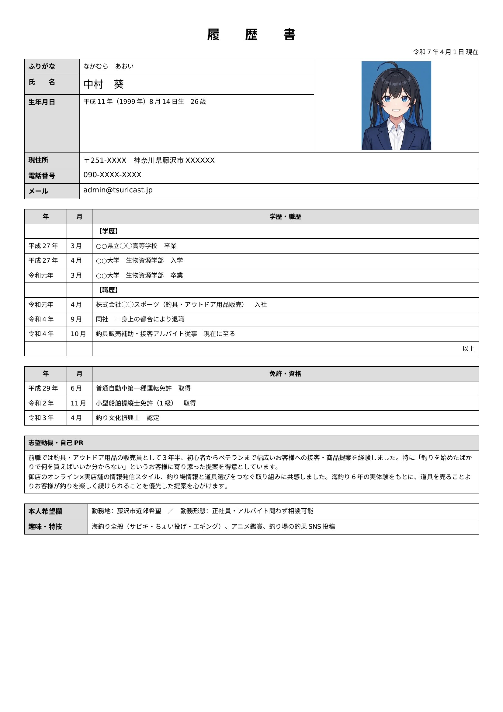

# 店長プロフィール。履歴書を貼ります。

こういうサイトをやっているくせに、自分のことをほとんど書いてこなかったので、ちゃんと自己紹介をしようと思います。

名前は広瀬茂（ひろせしげる）。つりキャストをひとりで作っています。

釣りをやり始めたのは子どもの頃で、父親に連れられて近所の川でフナを釣ったのが最初です。そのまま細々と続けて、今は主に海釣り──サーフのキスやヒラメ、漁港まわりのアジ・メバル、たまに磯でカサゴやメジナをやっています。

このサイトは「自分が釣りに行きたい場所の情報をまとめたい」という動機で作り始めました。よく調べたら「この護岸、立入禁止になってた」とか「駐車場が有料になってた」とか、古い情報で損することが多くて、だったら自分で管理できる場所に書いておこうと。気づいたら結構な規模になりました。

道具の話が好きです。特に古いリール。スピニングでもベイトでも、80〜90年代の日本製リールを見るとつい手が伸びます。使うのが目的というより、設計を見るのが楽しいのかもしれません。

詳細は下の履歴書をどうぞ。

---

