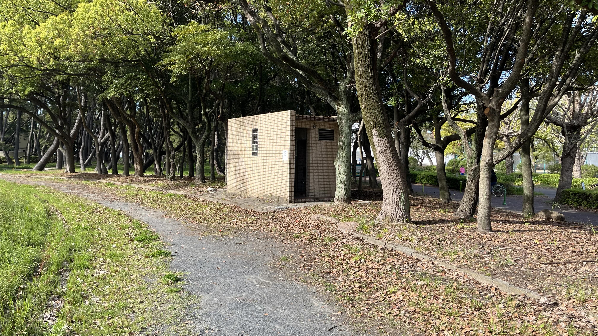
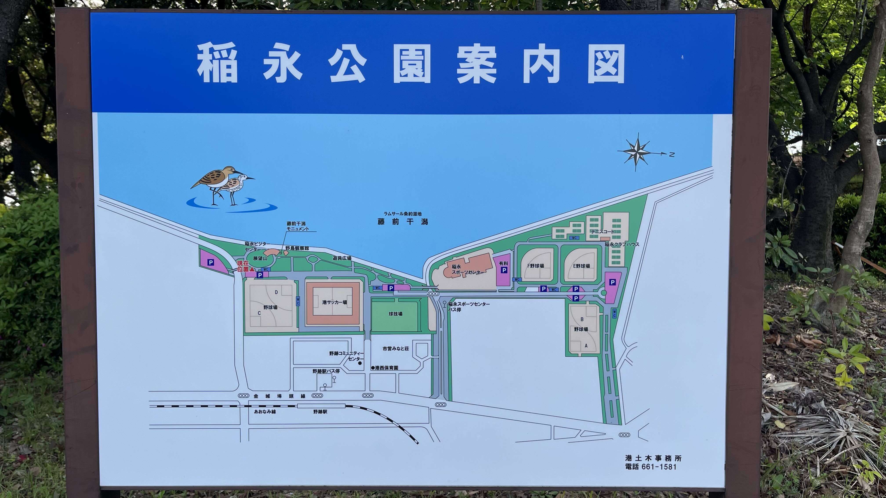
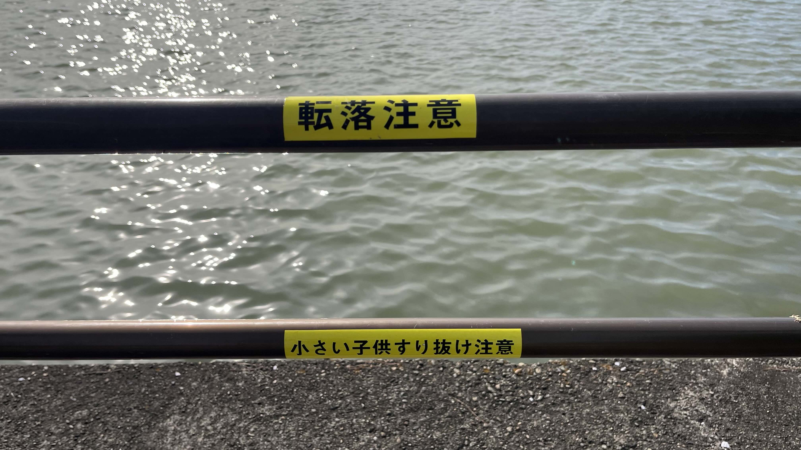

# 【稲永公園・庄内川河口レポート】名古屋のファミリー釣り場を徹底取材｜ハゼ・クロダイが狙える庄内川河口の釣りスポット

## はじめに｜スポーツ公園の一角に広がる、庄内川河口の釣り場

[稲永公園・庄内川河口](https://tsuricast.jp/aichi/isewan/nagoya/inae-kouen)は、庄内川の河口部に位置する公園の釣りスポットです。展望台・野球場・サッカー場・テニスコートなどが完備されたスポーツ公園の一部が釣り施設となっており、設備の充実度は折り紙つきです。

**取材日時**：2026年4月12日（日）  
**天候**：晴れ  
**気温**：19℃  
**風**：北西2m/s  
**波高**：0.3m（うねりなし）  
**海水温**：約15℃

---

## 自然環境｜野鳥の聖地でもある釣り場、マナーが問われる

野鳥が多く生息するエリアとして知られており、釣り場としてだけでなく自然観察のスポットとしても人気があります。**仕掛けや糸くずは必ず持ち帰り**、ゴミを残さないよう心がけましょう。自然を大切にする気持ちが、この釣り場を守ることに繋がります。

---

## 駐車場｜無料完備、関東アングラーには羨ましい限り

無料駐車場が完備されています。釣り場に最も近いのは**公園南側の2箇所**です。満車の場合は少し離れた有料駐車場も選択肢になります。

関東の釣り場では有料駐車場が当たり前なだけに、無料というのは純粋に嬉しいポイントです。

---

## トイレ｜清潔だが和式・男女兼用

清潔に保たれていますが、**男女兼用・和式**です。お子様連れの際は事前に確認しておくと安心です。

---

## 釣り場｜足場良好、柵あり。ただし子供の通り抜けに注意

足場が非常に良く、釣りやすい環境が整っています。柵のあるゾーンと、南側に柵のないゾーンの2エリアに分かれています。

ひとつ注意したいのが、**柵の隙間が子供が通り抜けられるサイズ**であること。お子様連れの際は必ずライフジャケットを着用させてください。

---

## 釣り人の声｜シーズンインはゴールデンウイーク前後か

取材時に釣り人の方々にお話を伺いました。

お友達同士で訪れていたグループは、チョイ投げ天秤に青イソメを付けてチョイ投げ。「ハゼでもクロダイでも何でもいいから来てほしい」と笑顔でお話しくださいました。汽水域という環境を考えると、その狙い方は理にかなっています。

常連の方によると、「今年はまだ誰も釣れていない」とのこと。取材が4月中旬ということを考えると、**ゴールデンウイーク前後からシーズンインする**と見てよさそうです。

---

## ターゲット魚種｜汽水域ならではのラインナップ

庄内川の河口という汽水域の特性から、以下のターゲットが期待できます。

- **ハゼ**：夏から秋にかけてがシーズン。チョイ投げや足元狙いで手軽に楽しめる
- **クロダイ**：汽水域の大物ターゲット。ウキ釣りやチョイ投げで狙いたい

お子さんはハゼ、大人はクロダイと、家族それぞれのターゲットを設定して楽しむのもおすすめです。

---

## まとめ｜交通アクセス・設備・無料駐車場の三拍子が揃った名古屋の優良釣り場

稲永公園・庄内川河口は、交通アクセスの良さ・充実した公園設備・無料駐車場という三拍子が揃った、名古屋エリアを代表するファミリー向け釣り場です。柵があり足場も良いため、釣り入門の場所としても最適。ただしお子様の安全のため、ライフジャケットの着用は忘れずに。

シーズンインはゴールデンウイーク前後。釣行計画の参考にしてみてください。

スポットの詳細情報は[Tsuricastのスポットページ](https://tsuricast.jp/aichi/isewan/nagoya/inae-kouen)でご確認ください。

---

※本記事の情報は取材時点のものです。釣り場のルールや利用可能エリアは変更される場合があります。現地の看板・案内表示を必ずご確認のうえ、マナーを守ってご利用ください。
