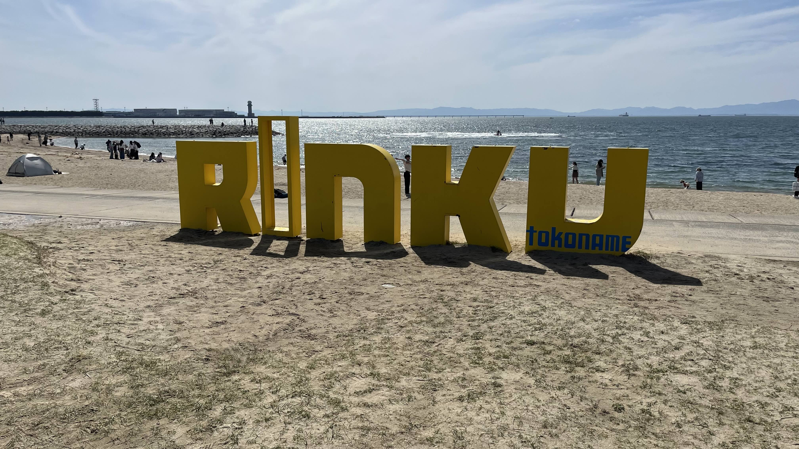
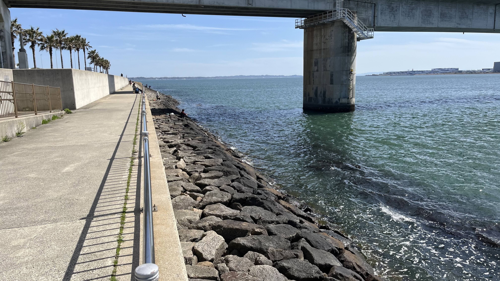
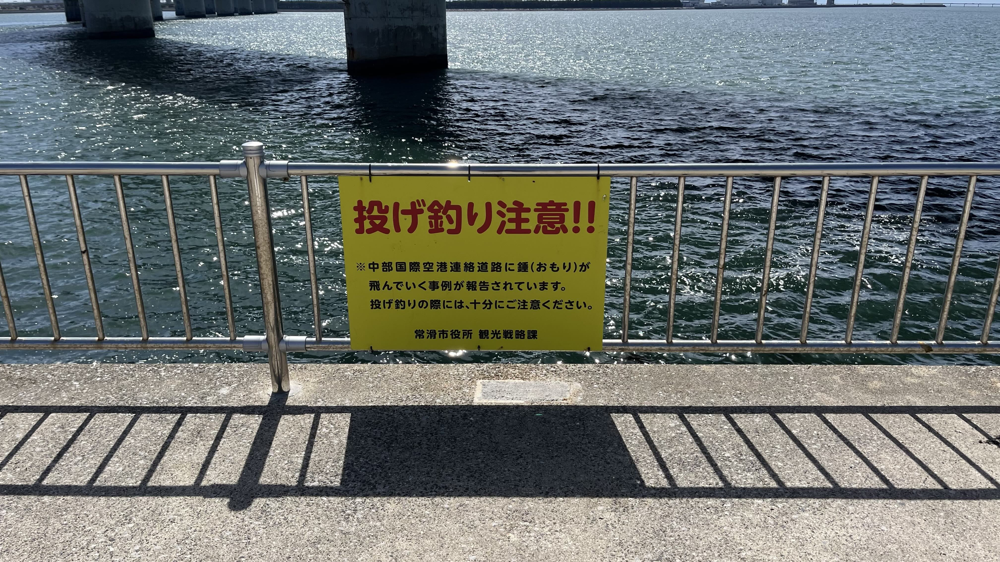

# 【常滑りんくう釣り護岸レポート】約850メートルの大型護岸を徹底取材｜ハゼ・キス・カサゴが狙える伊勢湾の穴場スポット

## はじめに｜中部国際空港を望む850メートルの釣り護岸

[常滑りんくう釣り護岸](https://tsuricast.jp/aichi/isewan/tokoname/rinku-gogan)は、中部国際空港の対岸に位置する臨海護岸公園の釣り場です。約850メートルにわたる護岸は、伊勢湾岸でも屈指のキャパシティを誇ります。

**取材日時**：2026年4月12日（日）  
**天候**：晴れ  
**気温**：19℃  
**風**：北西2m/s  
**波高**：0.3m（うねりなし）  
**海水温**：約15℃

4月中旬の取材ということもあり、まだハイシーズンとはいえない時期でしたが、釣り客の方も多くいらっしゃいました。それでも850メートルという護岸の長さのおかげで、この季節はまだまだ空きがある状態でした。

---

## 駐車場｜有料だが安心の完備

有料の駐車場が完備されています。取材時点の料金は以下のとおりです。

- **4〜10月**：1日1,000円
- **11〜3月**：1日500円

13時ごろの訪問でしたが、マルシェイベントが開催されている中でも満車にはなっていませんでした。広大な護岸のキャパシティを考えると、駐車場で困ることは少なそうです。

---

## トイレ｜清潔で設備充実

トイレは清潔に保たれています。海水浴場にもなるビーチが隣接しているため、**足洗い場や更衣室も完備**。夏場の釣りでも快適に過ごせる環境です。

---

## ビーチ｜釣りはできないので注意

駐車場のすぐ南にはビーチがあります。**ビーチエリアでは釣りはできません**。ご注意ください。

釣り場は、このビーチのさらに南の海岸線沿いにある釣り護岸です。

---

## 釣り護岸｜足元の人工岩礁から砂地まで、多彩なターゲットが狙える

釣り護岸は、ビーチのさらに南の海岸線沿いに続きます。足元には人工岩礁が入っており、**ブラクリを使った根魚（カサゴなど）の穴釣り**が楽しめます。その先には砂地が広がっており、**チョイ投げでシロギスやハゼ**を狙うことも可能です。

護岸の上を空港連絡道と名鉄線が通っているため橋脚があります。橋脚周りを狙い撃ちすると、思わぬ大物に出会えるかもしれません。

### 本格的な投げ釣りはNG

護岸の奥行きは約3メートル程度。**本格的な投げ竿での遠投はかなり難しい釣り場**です。また、現地の看板には「空港連絡道に天秤が吹っ飛んでいったことがある」との注意書きもあり、ここでの本格投げ釣りはおすすめできません。投げ釣りを楽しみたい方は、他のスポットと組み合わせての釣行を検討してください。

---

## 釣り人の声｜ハゼ・キス・カサゴが狙い目

取材時に何人かの釣り人にお話を伺いました。

- **ハゼ狙い**が最も多く、チョイ投げや足元狙いでコンスタントに釣果を上げている様子
- **チョイ投げでキス狙い**の方もちらほら。「季節的にちょっと早いかも」とのコメントも
- **カサゴの穴釣り**で成果を上げていた方は、落とし込み専用の短竿とベイトリールというスタイル。人工岩礁の隙間からカサゴを引き抜いたとのこと。この釣り場に最適なタックルのひとつかもしれません

全体的にファミリー客が多く、のんびりとした雰囲気の釣り場でした。

---

## 岸壁下の人工岩礁エリア｜身軽な装備で

岸壁に固定されたハシゴを降りると、岸壁下の人工岩礁エリアにアクセスできます。ただし**小さなお子様にはおすすめできません**。また、身軽なタックルで向かうのがベターです。

---

## まとめ｜釣りも遊びも１日楽しめる常滑りんくう釣り護岸

常滑りんくう釣り護岸は、釣りだけでなくビーチ遊び・BBQ・キャンプ・マルシェなど、**釣り以外のコンテンツも充実した複合レジャースポット**です。家族や仲間と１日プランを組んで訪れるのに最適です。

850メートルというキャパシティの大きさから、**グループでの釣りにもおすすめ**。ただし本格投げ釣りには向かないため、チョイ投げや穴釣りなどライトなスタイルで楽しむのが、この釣り場の正しい楽しみ方といえそうです。

スポットの詳細情報は[Tsuricastのスポットページ](https://tsuricast.jp/aichi/isewan/tokoname/rinku-gogan)でご確認ください。公式サイトは[こちら](https://rinku-beach.jp/)です。

---

※本記事の情報は取材時点のものです。釣り場のルールや利用可能エリアは変更される場合があります。現地の看板・案内表示を必ずご確認のうえ、マナーを守ってご利用ください。
