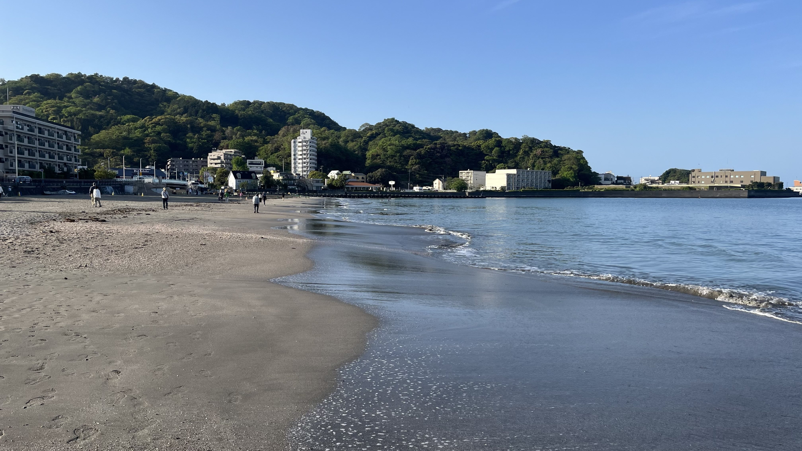
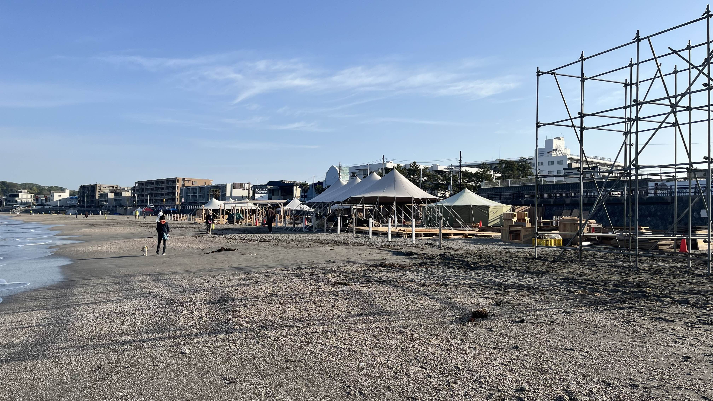
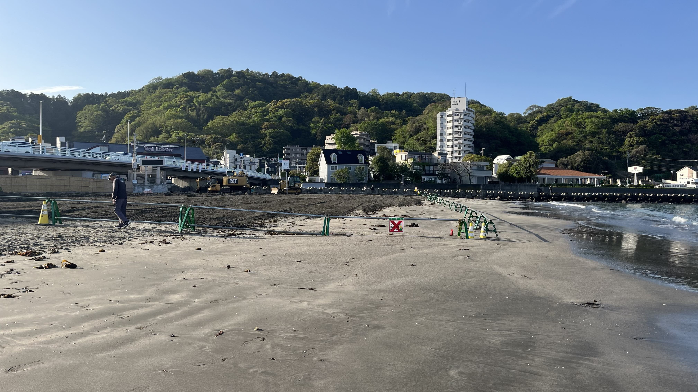
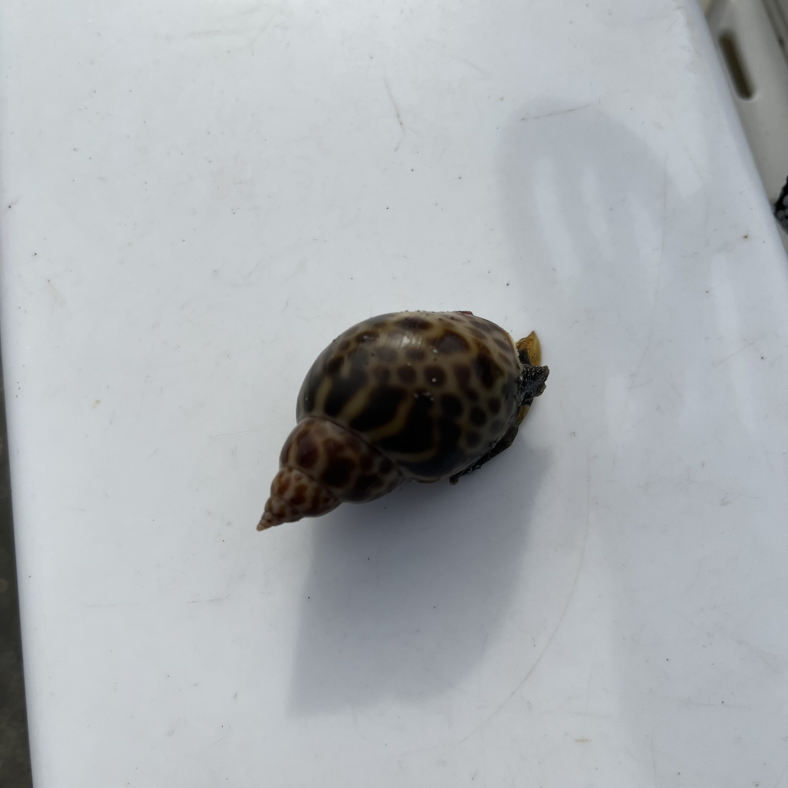
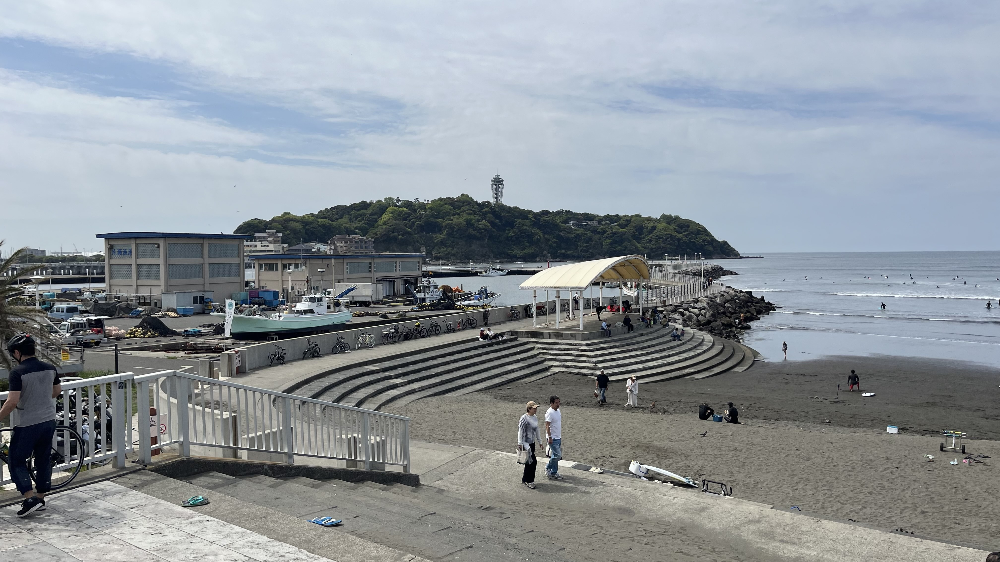
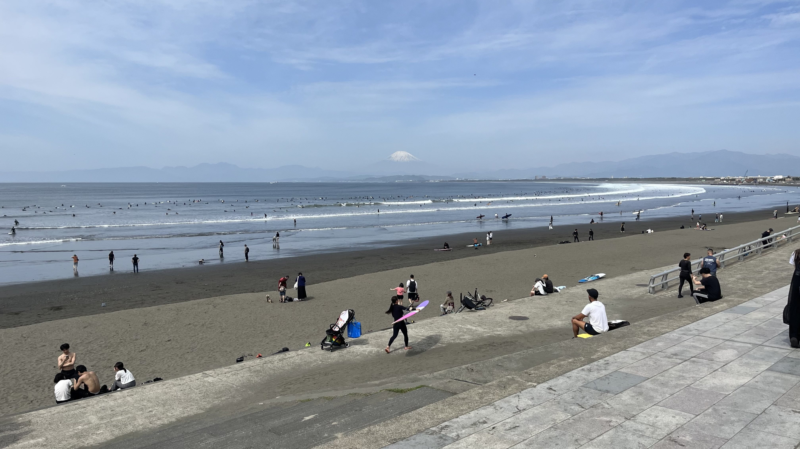
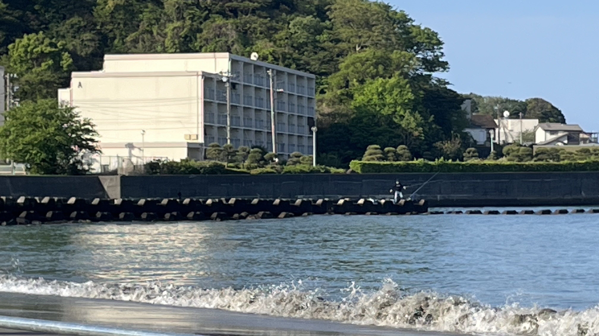
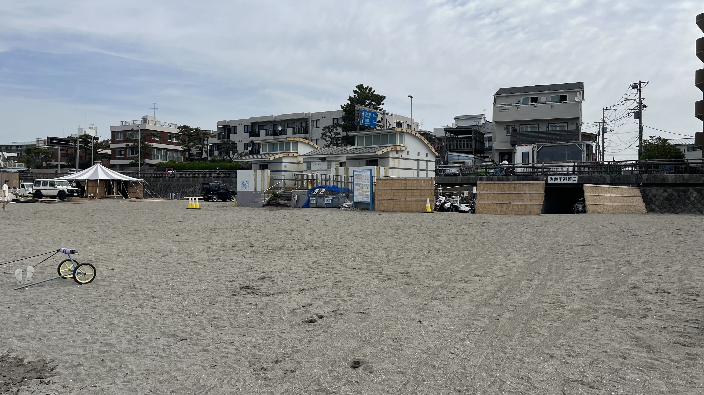

# 【逗子海岸・投げ釣りレポート】2026年シーズン開幕！バイガイでスタートを切った春の逗子海岸

## 今シーズンはバイガイスタート！

釣り人あるある——「今年こそシロギスの一番乗りを」と意気込んで浜に立ったものの、竿先が伝えてきたのはシロギスではありませんでした。それでも竿を振り抜き、糸を張り、砂浜に吹く春風を全身で受けたあの感覚は、紛れもなく「釣りシーズンの開幕」を告げるものです。

2026年4月19日（日）、逗子海岸にて今シーズン初の投げ釣りを敢行。釣果はバイガイ1匹。でも、いい。始まりました。

---

## 釣行データ

| 項目 | 内容 |
|---|---|
| 釣行日 | 2026年4月19日（日） |
| 釣り場 | [逗子海岸](https://tsuricast.jp/kanagawa/sagamibay/zushi/zushi-kaigan) |
| 天気 | 晴れ |
| 気温 | 12.7℃ |
| 潮 | 大潮（月齢0.6） |
| 風速・風向 | 1.8m/s 北東 |
| 波高 | 1.1m（波周期14s） |
| 海水温 | 16.1℃ |
| 降水量 | 0.0mm |

---

## タックル

- **竿**：ダイワ トーナメントプロキャスターAGS 27-405
- **リール**：ダイワ 17フリーゲン
- **仕掛け**：アスリートキス 4号（50本巻 市販品）

---

## 釣行記｜準備不足でもめげない、それが投げ釣り

### 出発〜エサ調達

早朝に自宅を出発。戸塚の上州屋でジャリメを買うつもりが、うっかり釣り場へ直行してしまいました。久しぶりの釣りはこういうことが起きますね。

134号線を走ると、6時半の由比ヶ浜・材木座海岸はすでにマリンスポーツ組が集結していました。逗子方面へ向かう道はまだ空いていて助かりました。

葉山のコンビニにアオイソメが1パックだけ残っていました。帽子を忘れたことに気づいたのはこのタイミング。まあ、いい。釣りに行ける喜びの方が大きいです。

### 釣り場の状況

逗子海岸に到着すると、釣り人の姿はゼロ。イベント準備中のスタッフとボランティアの清掃グループが砂浜を行き来していました。

地元の清掃ボランティアの方によると、「毎年この時期から2か月ほどイベントがある」とのこと。北側では工事も進んでいました。賑やかになるシーズン前のしんとした浜、それはそれで悪くありません。

釣り座について、エサを車に忘れてきたことに気づきました。取りに戻りました。疲れました。

### 実釣｜7:00〜9:00

逗子海岸は小さな湾に囲まれた地形のため、外洋のうねりや波の影響を受けにくいのが大きな特徴です。この時期のシロギスは遠浅よりも深さのある釣り場に分がありますが、台風うねりの影響を考慮して逗子を選びました。結果として波は穏やかで、釣りやすいコンディションではありました。シロギスは釣れませんでしたが。

湾内のため波は穏やかでしたが、遠くに白波が見えます。台風のうねりが伊豆半島の外から回り込んでいる模様でした。

**1投目**、真正面へフルキャスト。アタリなし。エサも取られません。

**2投目**、5色付近で小さなアタリ。回収すると針がありません。フグの仕業でしょうか。

**3投目**、2色でピクリとしたアタリ。フグと判断してサビき続けると——バイガイ。あの独特の重さと引きは、竿の感度があってこそと実感しました。トーナメントプロキャスターAGSのティップはやはり仕事をしてくれます。

移動しながら打ち返しましたが、アタリはフグらしきものばかり。砂浜にはワカメが打ち上げられていました。神奈川県ではワカメに共同漁業権が設定されているため、打ち上げられたものも持ち帰らない方がよいでしょう。

8時を過ぎるとSUPの方がちらほらとエントリーし始め、散歩を楽しむ人々も増えてきました。投げ竿を担いだ先客の釣り人がお帰りになる様子も見かけました。

**9:00、納竿。**

---

## 帰路｜台風うねりの134号線

帰りの国道134号線は相変わらずの渋滞。稲村ヶ崎、由比ヶ浜、七里ヶ浜、片瀬東浜——どこを見てもサーファーが波に乗っています。台風のうねりはシロギスには早すぎる波を運んできたようです。

片瀬西浜の様子も確認しましたが、サーフィンの天国。竿を持って浜に出てみましたが、端の端まで隙間がありません。今日は逗子で正解でした。

---

## 今シーズンの展望

海水温は16.1℃。シロギスの本格シーズンには、もう少し水温が上がるのを待ちたいところです。ゴールデンウイーク明けから6月にかけて、逗子〜湘南の各浜でシロギスが釣れ始めるはずです。

バイガイでスタートを切った2026年シーズン。次こそはあのピンッという明快なアタリを味わいたいものです。投げ竿を振り抜く快感は、もう指先が覚えています。

逗子海岸の詳細情報は[Tsuricastのスポットページ](https://tsuricast.jp/kanagawa/sagamibay/zushi/zushi-kaigan)でご確認ください。

---

## 逗子海岸・釣り場メモ

- **北側の川の河口**：汽水域の好スポット。ハゼやクロダイを狙うなら見逃せないエリアです

- **トイレ**：砂浜に複数あり。ファミリーでも安心です

---

※本記事の情報は釣行時点のものです。釣り場のルールや利用状況は変更される場合があります。現地の看板・案内表示を必ずご確認のうえ、マナーを守ってご利用ください。
