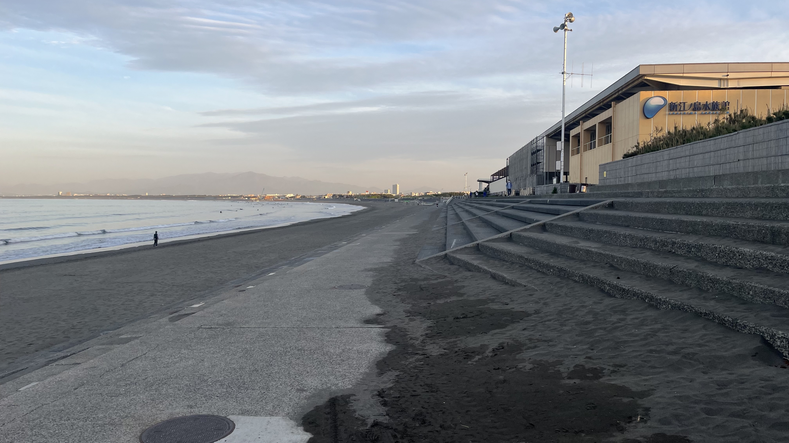
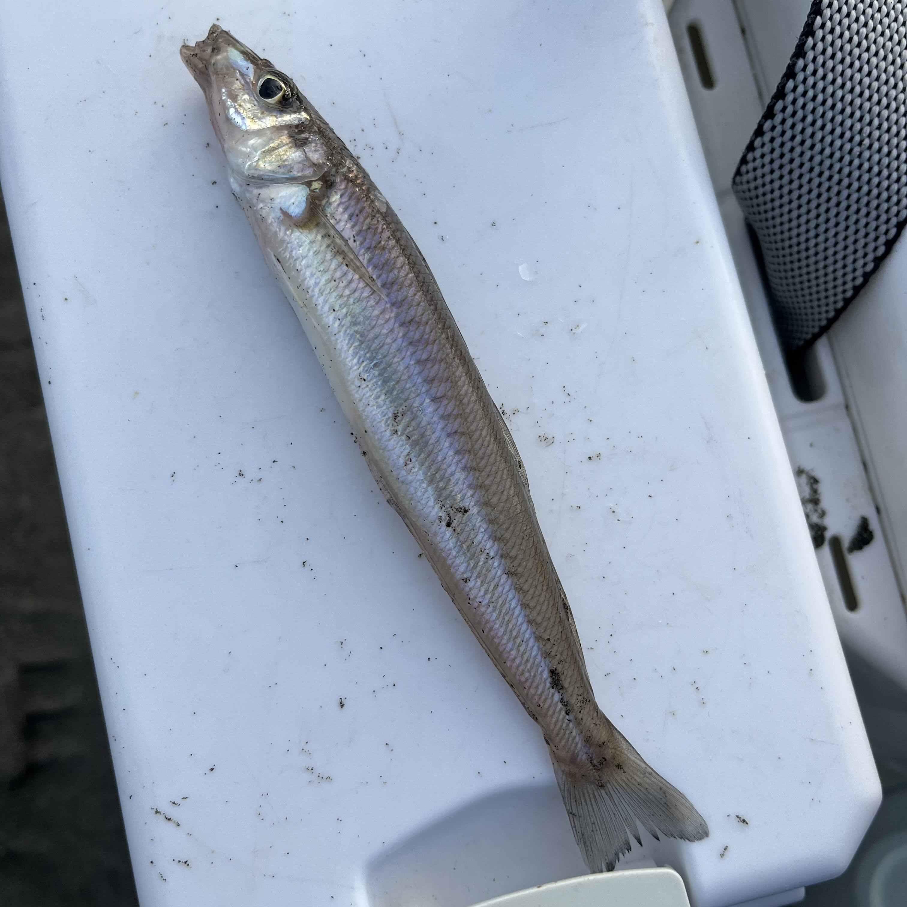
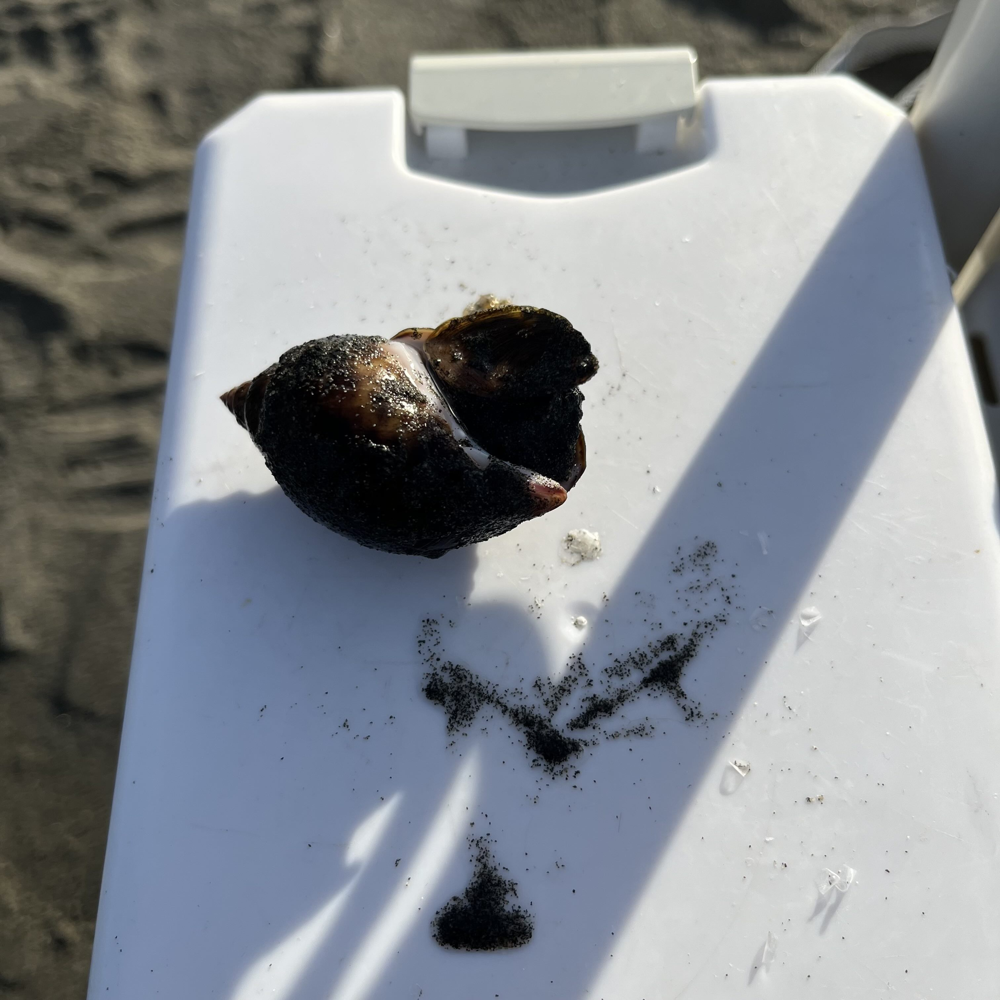

# 【片瀬西浜・投げ釣りレポート】平日朝活でシロギス初キャッチ！江ノ島を望む湘南の砂浜で春の釣りを満喫

## 「釣りに行きなさい。仕事です」

専属WEBコンサルタントからそう言われました。「WEBサイト作るのが面白いのは分かるけど、あなたは釣りに行きなさい」と。ありがたいお言葉です。

というわけで、平日朝活釣行を決行しました。目指すは片瀬西浜海岸。[Tsuricastの鵠沼海岸ライブカメラ](https://tsuricast.jp/kanagawa/sagamibay/fujisawa/katase)で海を確認すると、波は穏やか、人は少ない。行きましょう。帽子も忘れていません！

---

## 釣行データ

| 項目 | 内容 |
|---|---|
| 釣行日 | 2026年4月22日（水） |
| 釣り場 | [片瀬西浜](https://tsuricast.jp/kanagawa/sagamibay/fujisawa/katase) |
| 釣果 | シロギス1・バイガイ1 |

---

## タックル

- **竿**：ダイワ トーナメントプロキャスターAGS 27-405
- **リール**：ダイワ 17フリーゲン
- **仕掛け**：アスリートキス 4号（50本巻 市販品）
- **エサ**：アオイソメ（島きち丸にて購入。当日ジャリメ入荷なし）

---

## 釣行記｜平日の湘南、江ノ島を眺めながら竿を振る

### 出発〜準備

島きち丸さんでエサを購入し、江ノ電駐車センターに駐車。この日はジャリメの入荷がなく、アオイソメでの釣行となりました。平日の早朝とあって、どちらもスムーズでした。

### 5:30｜水族館エントランス前からスタート

新江ノ島水族館のエントランス前からスタート。1投目、仕掛けが絡んで上がってきました。久しぶりあるあるです。

そういえば、朝から大事な打ち合わせがあったはず。8時半には帰宅しなければなりません。手際よくいきましょう。

### 6:00｜イルカショープール前でシロギス登場！

イルカショープール前に移動すると、さっそくアタリ。4色いっぱいのところで竿先がピクピクと。上げてみると——シロギスです！今シーズン初のシロギス、来ました。

その後、スマホにメモを取りながら竿を膝の間に挟んでいると、またアタリ。しかし上げてみると針がない。フグの仕業でしょう。

### 6:30｜潮止まりで移動、謎のアタリに翻弄される

満潮・潮止まりのタイミングでサーファーが増えてきたため、東へ少し移動。

グイッグイッと力強いアタリ。キスなら良型、セイゴかチャリコの可能性も……と期待を膨らませながら上げてみると、何も付いていませんでした。恥ずかしい。

メモを取っていると、膝の間の竿にまたアタリ。今度はバイガイでした。先週の逗子に続き、バイガイとは縁があるようです。

### 7:00｜片瀬漁港白灯堤付近でフィッシュイーターの洗礼

片瀬漁港の白灯堤付近まで移動すると、デカいアタリ！ しかし乗らず。上げてみるとハリスがプッチンとやられていました。フィッシュイーターにピンギスを横取りされたようです。悔しいですが、これもまた投げ釣りの醍醐味です。

**7:00、納竿。**

---

## 釣果

| 魚種 | 数 | 備考 |
|---|---|---|
| シロギス | 1 | 4色付近 |
| バイガイ | 1 | リリース |

---

## まとめ｜アタリ多数、手応えを感じた朝活釣行

釣果は1尾と控えめでしたが、アタリは多く、シーズンの気配を十分に感じた釣行でした。フグ、バイガイ、フィッシュイーター——賑やかな顔ぶれが揃っているということは、海の中が確実に動き始めているサインです。

海水温が上がるゴールデンウイーク以降、片瀬西浜のシロギスはいよいよ本番を迎えそうです。次回は複数の良型シロギスを狙いに、また朝活で来ようと思います。

片瀬西浜の詳細情報は[Tsuricastのスポットページ](https://tsuricast.jp/kanagawa/sagamibay/fujisawa/katase)でご確認ください。

---

## 葵ちゃんコメント

先輩、「仕事です」って言われないと釣りに行けないんですか。帽子は忘れなかったのに竿を膝に挟んでメモ取ってるって、それ仕事してるんですか釣りしてるんですか。シロギス1匹ですけど、ちゃんと来てますよ。次はスマホしまって竿持ってください。​​​​​​​​​​​​​​​​

---

## 片瀬西浜・釣り場メモ

- **駐車場**：[江ノ電駐車センター](https://www.enoden.co.jp/tourism/parking/)が便利
- **エサ**：[島きち丸](https://shimakichimaru.com/)でジャリメ・アオイソメを購入可能
- **注意**：夏季はサーファーが多く、釣りエリアが限られる場合があります

---

※本記事の情報は釣行時点のものです。釣り場のルールや利用状況は変更される場合があります。現地の看板・案内表示を必ずご確認のうえ、マナーを守ってご利用ください。
