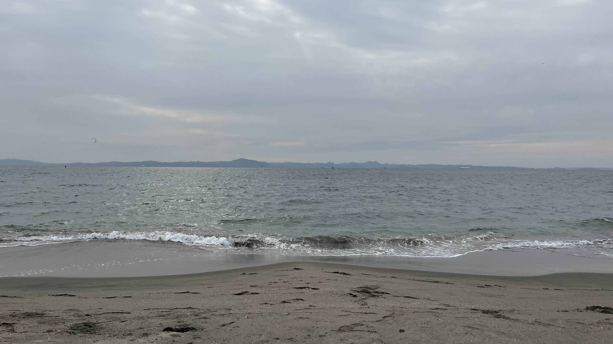
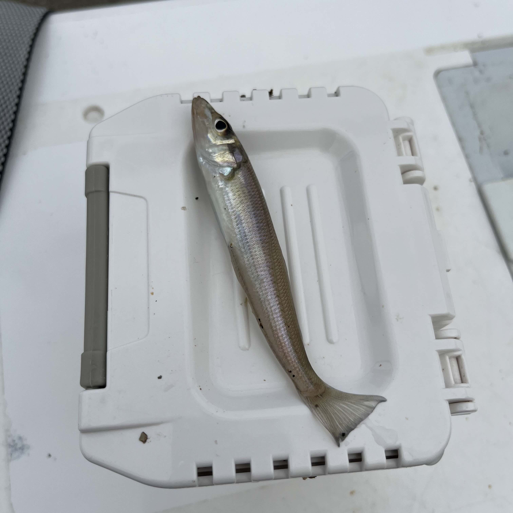
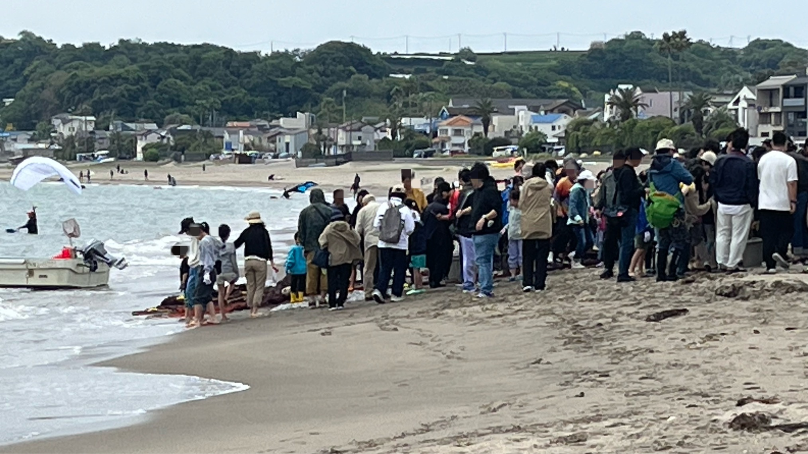
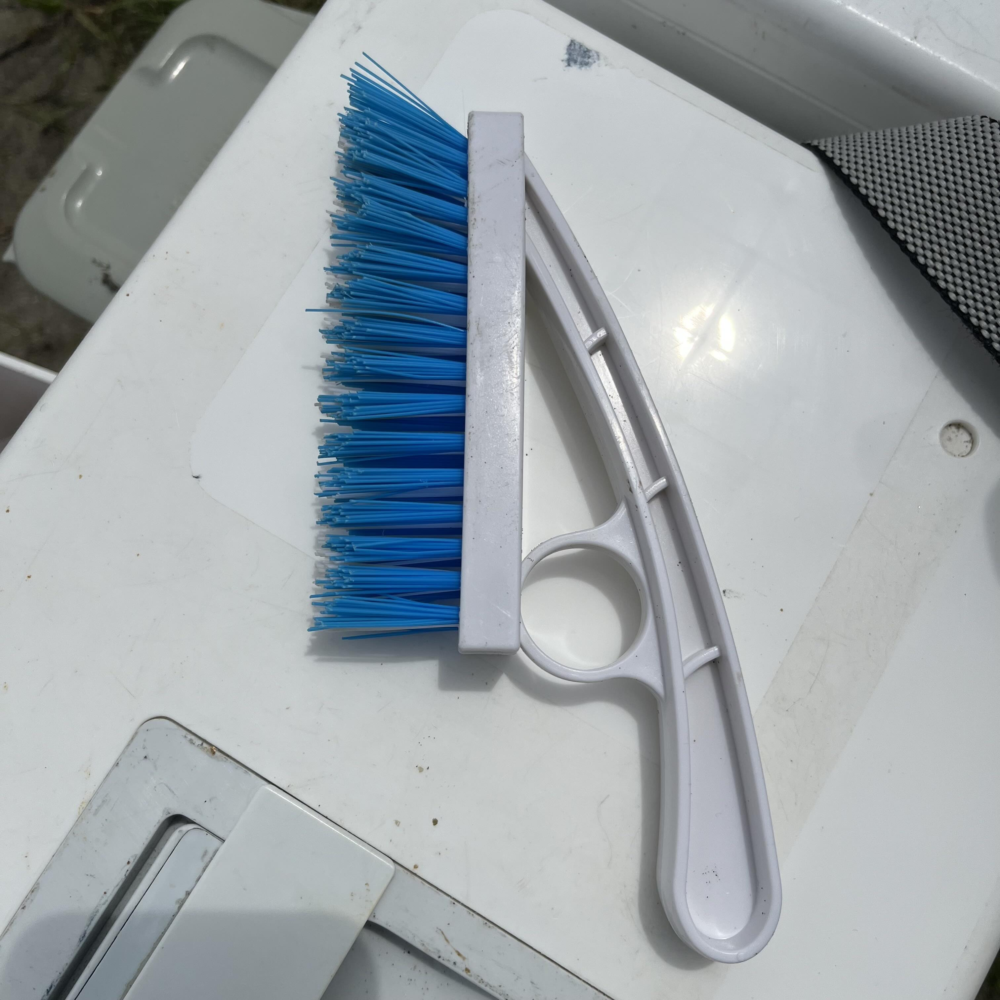

# 【三浦海岸・投げ釣りレポート】シロギス17尾！ETC忘れが生んだ三浦海岸での爆釣劇

## ETCがない。行き先変更。そして——大当たり。

釣り人の朝は早いです。4:00起床。最近は少し睡眠不足気味なので、本当に釣行しても安全かを自己チェックしながら朝食をとりました。[Tsuricast](/)でお目当てのスポットの気象を確認。曇りなので少し暖かい格好で行こうと準備を整え、5:50に出発しました。

横浜新道の入り口で気づきました。代車にETCが付いていない。アクアラインが片道3,000円、ETCレーンの約2倍です。これはダメだ。行き先変更です。

結果として、この「うっかり」が大当たりでした。

---

## 釣行データ

| 項目 | 内容 |
|---|---|
| 釣行日 | 2026年4月25日（土） |
| 釣り場 | [三浦海岸](/kanagawa/miura/miura/miura) |
| 天気 | 曇り |
| 気温 | 14℃ |
| 風速・風向 | 5m/s 北北東 |
| 潮 | 小潮 |
| 海水温 | 17.6℃ |
| 釣果 | <!-- catch-mask-start -->シロギス17・クサフグ1・ヒトデ1<!-- catch-mask-end --> |

---

## タックル

- **竿**：ダイワ トーナメントプロキャスターAGS 27-405
- **リール**：ダイワ 17フリーゲン
- **仕掛け**：アスリートキス 4号（50本巻 市販品）
- **天秤**：Lキャッチ20号 / デルナー25号（使い分け）
- **エサ**：ジャリメ（[エサの釣り王](https://www.esano-tsurioh.com/)にて購入）

---

## 釣行記｜1色の近場に魚が溜まっていた

### 出発〜エサ調達

行き先変更後、エサの釣り王さんへ。「今シーズンもよろしくお願いします」とご挨拶を交わし、釣り場の情報もいただきました。その情報をもとに三浦海岸に釣り場を決定。対岸には、行けるはずだった房総半島が見えます。あっちだったら追い風だったのに——愛車の修理が終わったら、必ずリベンジです。

### 7:30｜ファミリーマート前からスタート

ファミリーマート前に入り、1投目。Lキャッチ20号で投げましたが、北北東の横風で思うように飛びません。3色からサビいてくると——まさかの1色でアタリ。上げてみると小さい！それでも1尾は1尾です。今シーズン初の三浦海岸、幸先よくシロギスが顔を見せてくれました。

気温14℃、風5m/s。体感的にはなかなかの寒さです。

### アタリの傾向をつかむ

天秤をデルナー25号に換えてみると、2投目は1色付近でモヤモヤっとしたアタリ。ただしデルナーだとアタリが分かりにくい。ヒトデ1、キス2という結果でしたが、手感度の面でLキャッチに軍配が上がりそうです。

Lキャッチに戻して「1色狙い撃ち作戦」へ切り替えると、やはり1色でアタリ。連掛けを狙いましたが、この日は単発。それでもコンスタントにアタリが出続けました。

3投目は1.5色でアタリ、2尾付いた感触あり。上げてみるとクサフグ1、キス1。惜しい。

4投目はフグにやられ針がひとつ消え、5投目は針が全滅して戻ってきました。フグの猛攻もシーズンの証拠です。

### 10:00｜ローカルルールで移動、地引網と遭遇

10時になるとファミリーマートより南はマリンスポーツエリアになるとのこと。地引網も同じ場所で行われるとのことで、エネオスより北のエリアへ移動しました。

地引網の漁師の方に「この時期は何が揚がりますか？」と尋ねると、「なんも」とのお答え。素直さが心地よかったです。

### 11:00｜地引網後の一手

地引網の後は、海中の生き物が掘り起こされてシロギスが寄ると聞いたことがあったので狙ってみましたが、今日はダメでした。少し移動すると、初投から3色でアタリ。3連で上がってきました。コンスタントに釣れ続けた釣行の締めにふさわしい1投でした。

エサの付け方が大きくなってきたら、「早く使い切って帰りたいサイン」です。釣り人なら分かるあの感覚。この1投で終わりにしようと決めました。

**11:40、納竿。**

借り物の車に砂だらけの道具を載せるわけにはいかない。
そんな時には、これ！　100円ショップに売ってます。

帰りにエサの釣り王さんへ立ち寄り、釣果を共有してから帰宅しました。

---

## 釣果

<!-- catch-mask-start -->

| 魚種 | 数 | 備考 |
|---|---|---|
| シロギス | 17 | 全キープ |
| クサフグ | 1 | リリース |
| ヒトデ | 1 | リリース |

<!-- catch-mask-end -->

---

## まとめ｜三浦海岸、1色の近場にシロギスあり

この日のパターンは「1色狙い」でした。遠投よりも近場に魚が溜まっている状況で、丁寧に1色付近をサビくのが正解でした。海水温17.6℃、シーズンは確実に上向いています。

ETCのない代車が、思わぬ好釣果を連れてきてくれました。釣りは何があるか分からない。それが面白いところです。

三浦海岸の詳細情報は[Tsuricastのスポットページ](/kanagawa/miura/miura/miura)でご確認ください。エサの調達は[エサの釣り王](https://www.esano-tsurioh.com/)さんが便利です。

---

## 葵ちゃんコメント

ETC忘れて行き先変更して17尾、しかも「大当たり」って自分で言っちゃってるの、なかなかですよ。逗子はバイガイ、三浦は爆釣、うっかりの釣果が良すぎて、次から意図的にETC忘れそうで心配です。海水温17.6℃、1色にキスが溜まってたのはちゃんとした読みだと思います。房総リベンジ、愛車が戻ったらぜひ。

---

※本記事の情報は釣行時点のものです。釣り場のルールや利用状況は変更される場合があります。現地の看板・案内表示を必ずご確認のうえ、マナーを守ってご利用ください。
