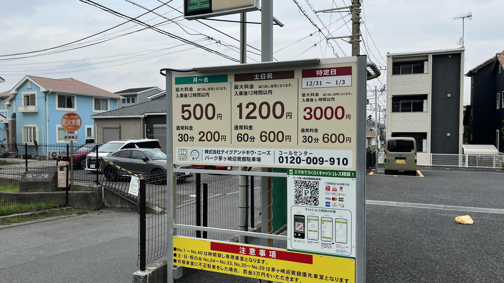
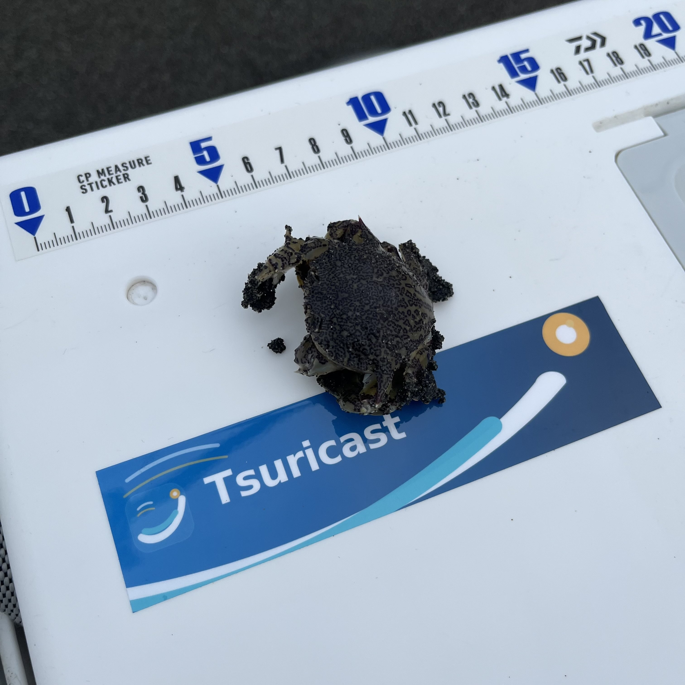
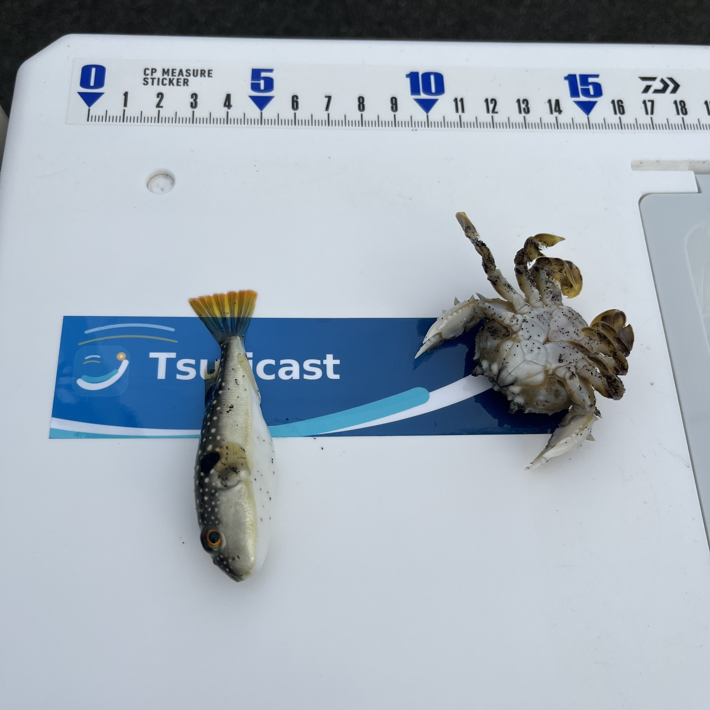
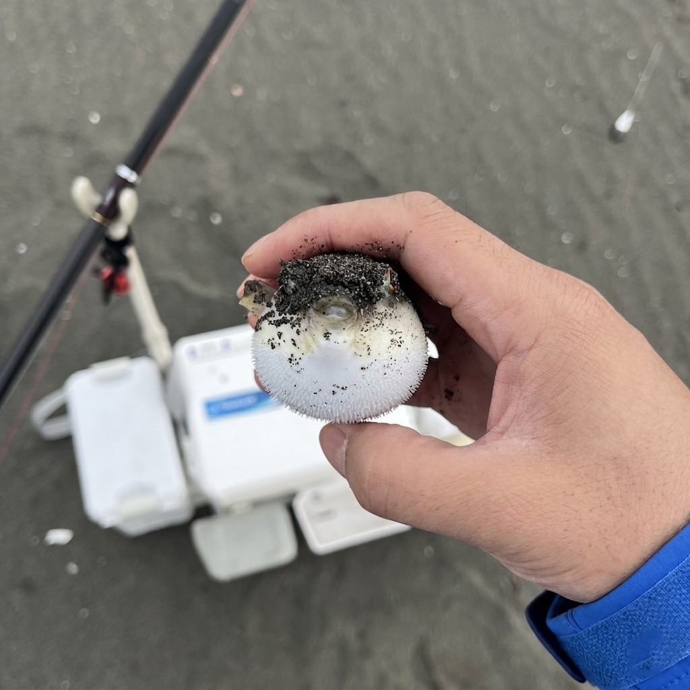
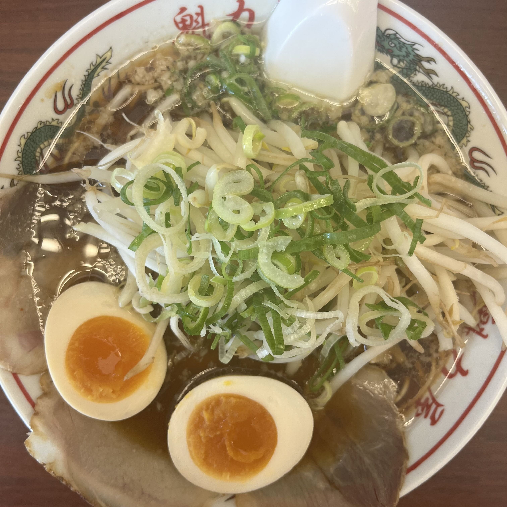

# 【茅ヶ崎海岸・投げ釣りレポート】追い風の茅ヶ崎でカニ2・フグ2……キスはお預け

## 愛車が戻ってきた。さあ、茅ヶ崎へ。

4:00起床。昨夜はタックルページの更新作業も早々に切り上げて就寝したので、寝不足感はありません。今日は茅ヶ崎に取材兼釣行です。そして愛車も無事に戻ってきました。（今日はETC要らないですが）

ベランダでコーヒーを飲みながら気温と風の強さを確認。野鳥の鳴き声に耳を傾けていたら、空が夜から朝へと変わろうとしていました。今日はやりやすそうです。

---

## 釣行データ

| 項目 | 内容 |
|---|---|
| 釣行日 | 2026年4月29日（水） |
| 釣り場 | [茅ヶ崎海岸](/kanagawa/sagamibay/chigasaki/chigasaki-kaigan) |
| 天気 | 曇り |
| 気温 | 15℃ |
| 風速・風向 | 4m/s 北東 |
| 波高 | 0.4m（波周期6s） |
| 潮 | 中潮 |
| 海水温 | 18.5℃ |
| 釣果 | <!-- catch-mask-start -->カニ2・フグ2（キスはお預け）<!-- catch-mask-end --> |

---

## タックル

- **竿**：ダイワ トーナメントプロキャスターAGS 27-405
- **リール**：ダイワ 17フリーゲン
- **仕掛け**：アスリートキス 4号（50本巻 市販品）
- **エサ**：ジャリメ（上州屋戸塚原宿店にて購入）

---

## エサ調達について｜ジャリメ品薄に注意

最近、中国産ジャリメが品薄で、釣具屋によっては入荷がない状況です。国産がメインになっているとのことで、事前に在庫確認の電話を入れてから向かうのが安心です。茅ヶ崎海岸であれば、漁港近くの磯屋さんでもエサが購入できます。

また、湘南の国道134号沿いはコンビニが少ないため、早めに食料調達をしておくことをおすすめします。

---

## 釣行記｜追い風の茅ヶ崎、魚はいる——でも釣れない

### 5:00｜出発〜現地へ

上州屋戸塚原宿店でジャリメ30gを調達し、コンビニでおにぎりを仕入れて出発。駐車はパーク茅ヶ崎迎賓館駐車場を利用しました。キャパがあってPayPayも使えるので便利です。

駐車場で地元のアングラーとお話しする機会があり、夜のルアーでマゴチ60センチを仕留めたとのこと。これはシロギスも回っているかもしれないと期待が高まります。

### 6:00｜サザンビーチからスタート

先着のアングラーに状況を聞くと「触りもしない」とのこと。さっきまでの期待はどこへ。

確かに波が少し高めで、東側はサーファーと波足で厳しそうです。本日はビーチ西側を中心に攻めることにしました。

**1投目**、何か付いた感触はあるもののキスではなさそうなのでサビき続けると——カニでした。

### Xのお知り合いと情報交換

Xきっかけで顔見知りの方がいらっしゃり、最近の茅ヶ崎の状況を伺うと「この時期の割には釣れている」とのこと。Tsuricastの名前を覚えていてくれていたのが少し嬉しかったです。6色でアタリがあったとのことで、今日の追い風なら届きそうです。

**2投目**、目指せ6色で気合いが空回りしてミスキャスト4色。めげずにサビくと1色でアタリ——カニとフグ。

**3投目**、50mほど移動してギリギリ6色に届きました。そこで小さなアタリ。その後は魚信がないままでした。

### なぜ、食事中に限ってアタリがあるのか

これは長年の謎です。おにぎりを食べ終わるまで待っていてほしいのですが——おにぎりを食べていたらフィッシュイーターに横取りされました。

### 8:20｜お隣では連続キャッチ

Xのお知り合いがやっとシロギスをゲット。そして連続キャッチ。もうお一方も1尾キャッチ。さらにダブルキャッチ。魚はいるんです。いるんですが……私だけカニしか釣れていません。

遠投力は正義です。この日ばかりは痛感しました。

### 10:00｜最後の一投、針が全滅

お二方がお帰りになる前に釣果を伺うと、「神風9色で6尾」とのことでした。投げ釣りの道糸は一般的に8色まで。つまり追い風に乗った遠投ジョークです。笑いながらも、正直うらやましい。

サーファーと団体観光客の合間を縫って最後の一投——針が全滅していました。もう終わりです。

**10:30、納竿。**

### 反省会｜ラーメンという名の反省会

釣れなかった日には反省会が必要です。ラーメンを食べながら今日の釣りを振り返る——そういうことにしておきましょう。これも釣りの楽しみのひとつです。

---

## 釣果

<!-- catch-mask-start -->

| 魚種 | 数 | 備考 |
|---|---|---|
| シロギス | 0 | — |
| カニ | 2 | リリース |
| クサフグ | 2 | リリース |

<!-- catch-mask-end -->

---

## まとめ｜海水温18.5℃、魚は確実にいる

せっかくの追い風を生かしきれず、キスはゼロに終わりました。エサも余ってしまいました。

ただ、海水温は18.5℃まで上昇し、マゴチ・シロギスともに釣果情報が出始めています。茅ヶ崎海岸のシーズンは着実に上向いています。遠投力を磨いて、次こそは6色の向こうにいる魚を手元に呼び込みたいと思います。

茅ヶ崎海岸の詳細情報は[Tsuricastのスポットページ](/kanagawa/sagamibay/chigasaki/chigasaki-kaigan)でご確認ください。

---

## 葵ちゃんコメント

「気合いが空回りしてミスキャスト4色」って先輩、気合い入れたら飛距離落ちてどうするんですか。あと「長年の謎」とか言ってますけど竿置いてご飯食べてるからですよ。カニ2フグ2でラーメン食べに行く前向きさだけは認めます🎣

---

## 茅ヶ崎海岸・釣り場メモ

- **駐車場**：パーク茅ヶ崎迎賓館駐車場が便利（PayPay対応）
- **エサ**：[上州屋戸塚原宿店](https://www.johshuya.co.jp/)、または漁港近くの磯屋さんで購入可能。ジャリメは事前に在庫確認を
- **コンビニ**：134号沿いは少ないため早めに調達を

---

※本記事の情報は釣行時点のものです。釣り場のルールや利用状況は変更される場合があります。現地の看板・案内表示を必ずご確認のうえ、マナーを守ってご利用ください。
