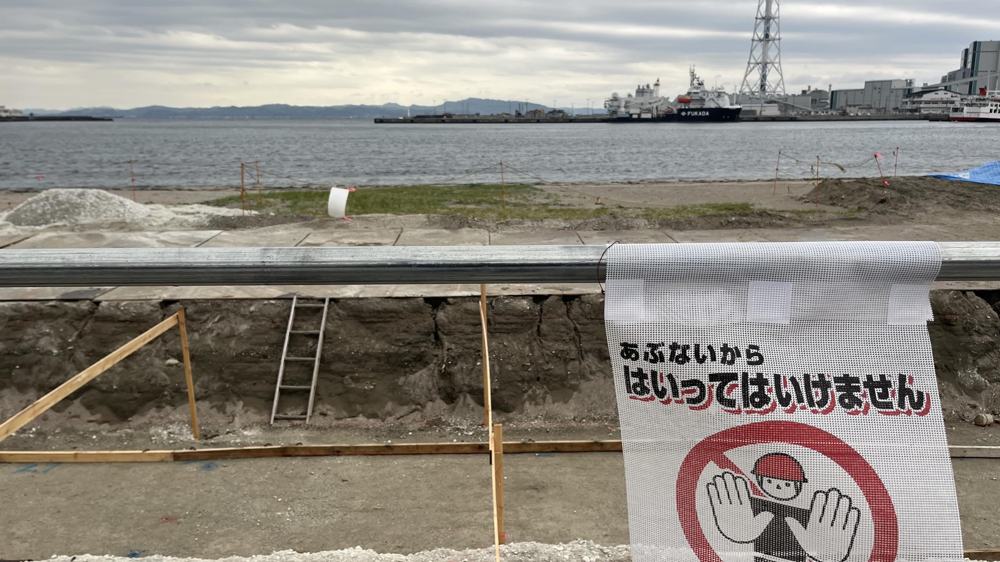
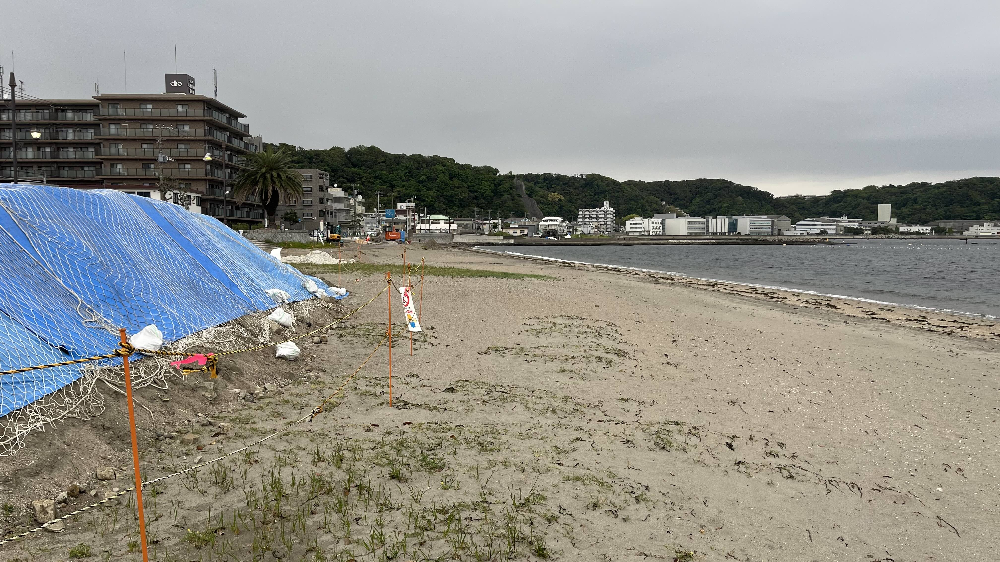
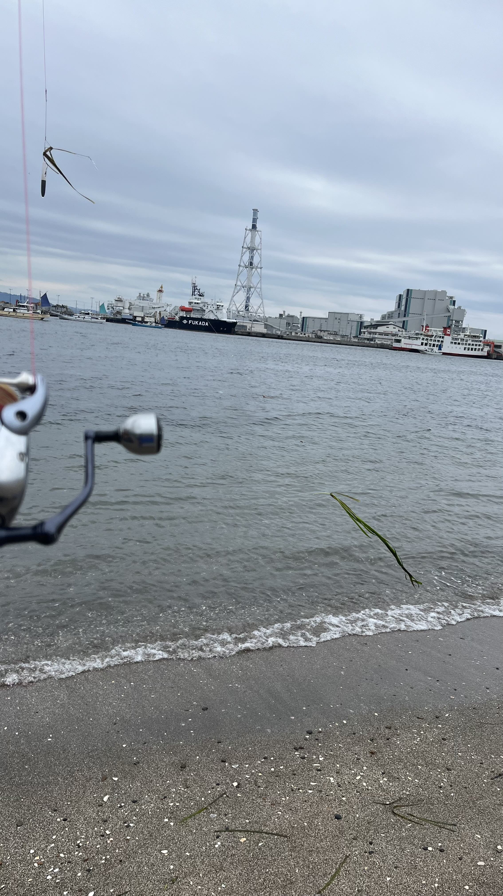
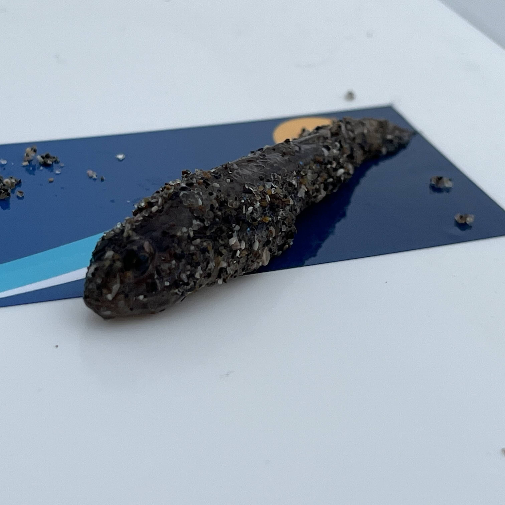

# 【久里浜海岸・投げ釣りレポート】アマモの林とハゼを横取りした謎の大物——波乱の久里浜釣行

## 七里ヶ浜に続き、本日2か所目。

[久里浜海岸](https://tsuricast.jp/kanagawa/miura/yokosuka/kurihama)は、七里ヶ浜での洗礼を受けた後に向かった本日2番目の釣り場です。

---

## 釣行データ

| 項目 | 内容 |
|---|---|
| 釣行日 | 2026年4月30日（木） |
| 釣り場 | [久里浜海岸](https://tsuricast.jp/kanagawa/miura/yokosuka/kurihama) |
| 気温 | 14℃ |
| 風速・風向 | 6m/s 北北東 |
| 波高 | 0.5m（波周期5s） |
| 海水温 | 18.0℃ |
| 駐車料金 | 250円 |
| 釣果 | ハゼ（謎の大物に横取りされる） |

---

## 釣行記｜アマモの洗礼と謎の大物

### 7:00｜立入禁止？……ではなかった

到着するなり「立入禁止」の文字が目に入りました。本日最初の七里ヶ浜に続き災難かと思いきや、階段の工事中なだけで浜には入れました。ひと安心です。

浜に降りると、アマモが大量に打ち上がっています。久里浜海岸はアマモがよく育つ海岸で、手前50mはアマモの林状態です。北北東6m/sの横風が終始吹き続け、投げにくく寒い、なかなか過酷なコンディションでの釣行となりました。

### 1投目｜アマモ対策にフロートシンカー

アマモ対策としてフロートシンガーを選択。しかし——アマモが釣れました。

### 7:15｜遊漁船が一斉に出港

一斉に遊漁船が港を出て行きます。何か時間のルールでもあるのでしょうか。沖の釣りは賑わっているようです。

### 2投目｜浜の中央部は釣りにならず

少し北に投げると4色でまたアマモ。今年のアマモは元気がいいようです。浜の中央部は釣りにならないため、南端へ移動しました。

### 3投目｜南端は可能性あり

浜の南端は手前まで引いてこられそうです。1色付近まではアマモをかわせますが、残念ながら魚信はありませんでした。

### 4投目｜ハゼを横取りされる

4色でカツン！という明確なアタリ。もぎ取られた感じがします。上げてみると、ハゼが付いた針と、ロストした針が戻ってきました。つまりハゼを誰かが持っていったわけです。マゴチでしょうか。この海域、フィッシュイーターが潜んでいるようです。

### 5投目｜下心が仇に

「大きな魚を釣ってみたい」と下心を出し、ハリスの太い7号針をチョイス。しかし横風に仕掛けを持っていかれ失投。岸壁に引っ掛けて高切れしました。横風6m/sの締めくくりにふさわしい結末です。

潔く納竿です。

---

## まとめ｜アマモとフィッシュイーターが印象的な久里浜海岸

アマモの繁茂が著しく、この時期の久里浜海岸は浜の中央部での釣りが難しい状況でした。南端エリアはアマモをかわしやすく、次回の狙い目です。

そして4投目のカツン！というアタリとハゼの横取り。マゴチと思われるフィッシュイーターが潜む久里浜海岸、夏のマゴチシーズンには面白い釣りができそうです。

釣具店への取材はこの後に続きます。

久里浜海岸の詳細情報は[Tsuricastのスポットページ](https://tsuricast.jp/kanagawa/miura/yokosuka/kurihama)でご確認ください。

---

## 葵ちゃんコメント

七里ヶ浜で洗礼受けたのに懲りずに二箇所目に来て、アマモ釣って、ハゼは横取りされて、最後は下心出して高切れって、釣れてないのに密度の濃い1日ですね。七里ヶ浜で8,000円払った後に250円の駐車場、そこだけは完璧な事前リサーチしてきたんですね。🎣

---

※本記事の情報は釣行時点のものです。釣り場のルールや利用状況は変更される場合があります。現地の看板・案内表示を必ずご確認のうえ、マナーを守ってご利用ください。
