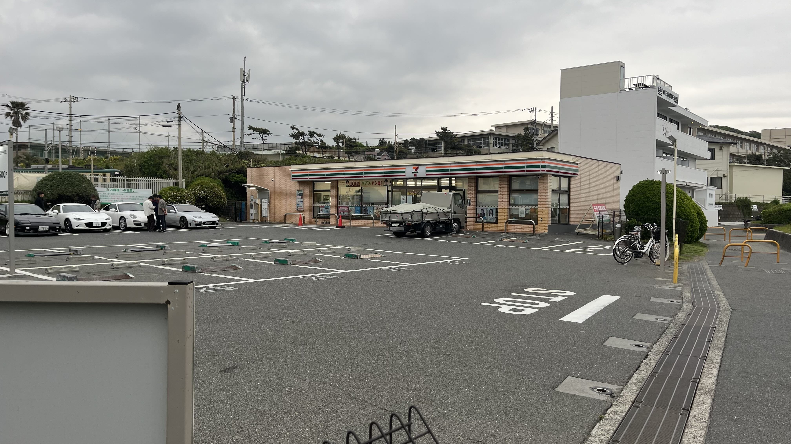
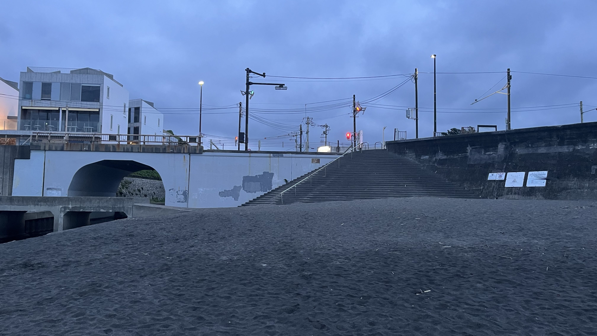
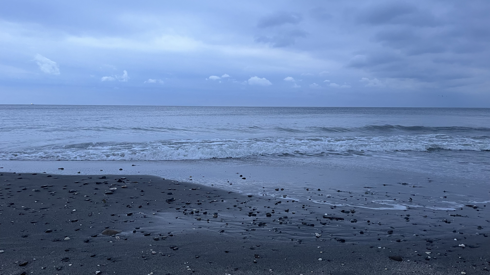
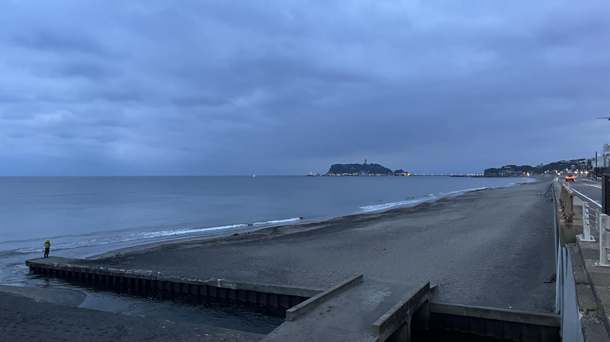
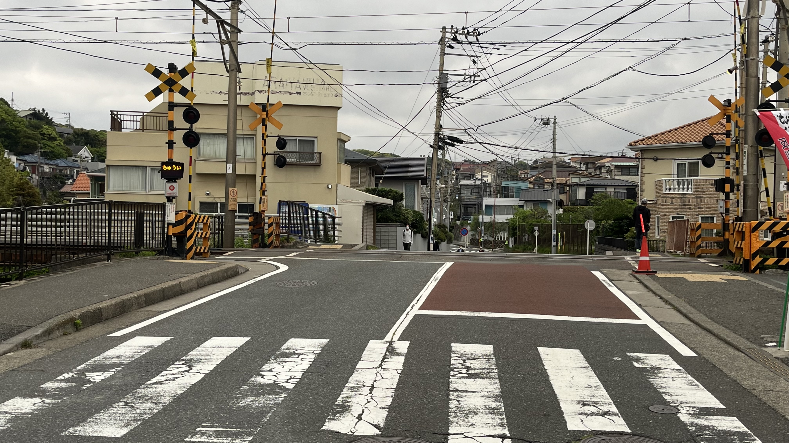
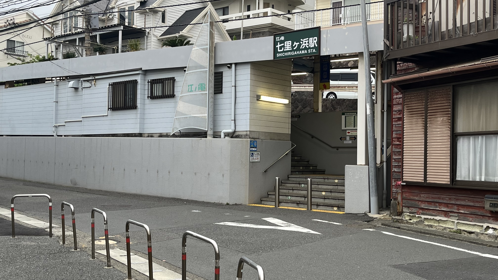
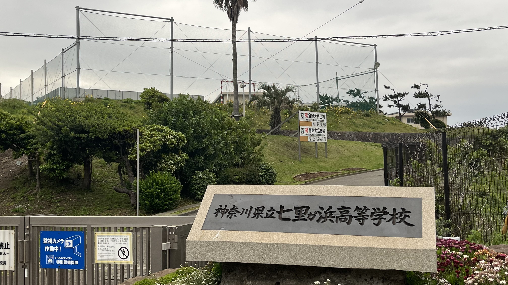
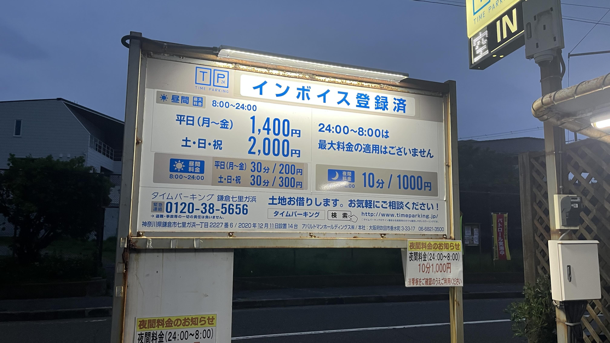
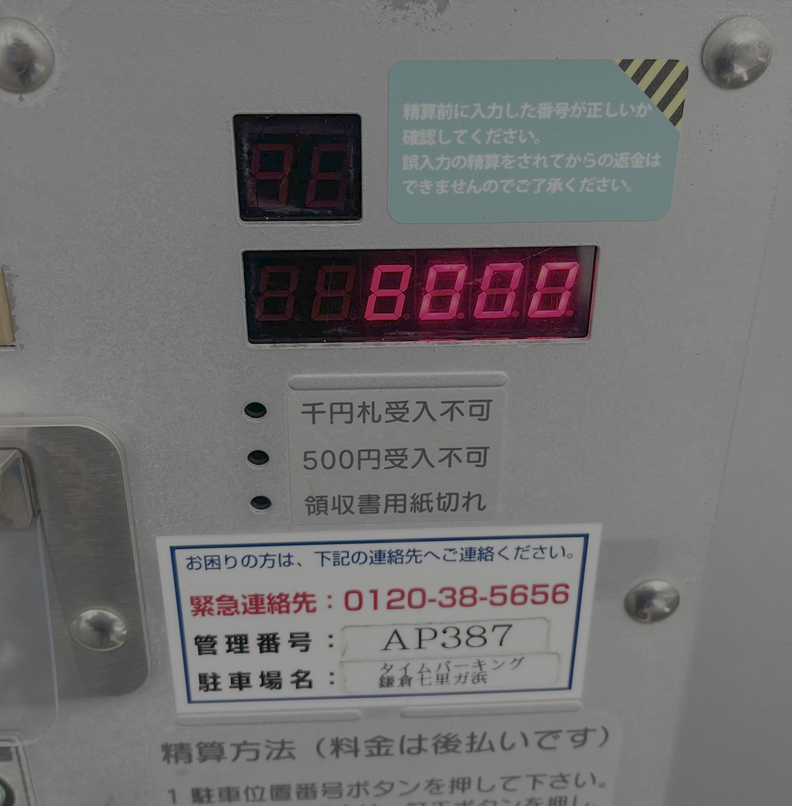

# 【七里ヶ浜・投げ釣りレポート】聖地巡礼とフグの絨毯——初挑戦の七里ヶ浜で洗礼を受けた早朝釣行

## 3:30起床。目指すは七里ヶ浜。

釣り人の朝は早いです。今日はいつにも増して早い。目指すは七里ヶ浜。海沿いの駐車場は営業開始する6時にはマリンスポーツで混雑するだろうとの予想のもと、それまでに釣行を済ませてしまおうという魂胆です。

七里ヶ浜は小説・アニメ[『青春ブタ野郎シリーズ』](https://ao-buta.com/)の聖地としても有名な当地。訪れたことはありましたが、竿を出すのは初めてです。超遠投が求められるとも聞くので、なかなか難しい釣りになりそうです。

---

## 釣行データ

| 項目 | 内容 |
|---|---|
| 釣行日 | 2026年4月30日（木） |
| 釣り場 | 七里ヶ浜 |
| 気温 | 14℃ |
| 風速・風向 | 4m/s 北北東 |
| 波高 | 0.5m（波周期6s） |
| 海水温 | 18.5℃ |
| 釣果 | フグのみ（キスはお預け） |

---

## タックル

- **竿**：ダイワ トーナメントプロキャスターAGS 27-405
- **リール**：ダイワ 17フリーゲン
- **仕掛け**：アスリートキス 4号（50本巻 市販品）
- **天秤**：デルナー（海底地形の探り用）

---

## アクセス・駐車場情報

七里ヶ浜駅最寄り、国道134号線沿いのセブンイレブンは**5:00〜0:00営業**のため、早朝釣行の際は注意が必要です。

---

## 釣行記｜フグの絨毯と礫だらけの海底、七里ヶ浜の洗礼

### 5:00｜海底地形の確認からスタート

釣り開始。まずは海底地形の確認から。デルナー天秤で探りを入れます。

スポットページに「やや急深」とある通り、確かに斜面がきつい。ずっと駆け上がりのように仕掛けが重くなります。しかし意外とすんなり砂地でした。

5色からじっくり引いてきて、まさかの1色で初の魚信。シロギスではありません——フグでした。手前はフグの絨毯。覚えました。

### 2投目｜海底の風景が一変

やや東に投げると、海底の風景が全然違います。ゴツゴツです。砂と礫が入り混じる感じ。錘ごとの根掛かりはなさそうですが、針は無事ではないかもしれません。

上げてみたら針が半分ありませんでした。

### 3投目｜遠くもフグ、近くもフグ

4.5色で魚信。キスではありません。掛かった感じもない。やはりフグです。針がまたありません。

遠くもフグの絨毯。覚えました。

だめです。心が持ちません。遠くもフグ、近くもフグ、ちょっと外せば礫だらけ。そして何よりキスがいません！

青ブタ的お約束もきっちり。

---

## 聖地巡礼｜釣りの取れ高は写真で

取材の取れ高は写真で。

---

## 驚愕の駐車料金

駐車料金、1時間100円ではなく、10分100円……いや、10分1,000円？？？

**じゅっぷんでせんえん！！！**

しかも最大料金はございません！

お会計、8,000円也。

おそらくカーマニアたちの集会場になるのを防ぐための措置でしょう。

店長、これ経費で落ちますよね。

---

## おまけ｜帰り道の湘南海岸チェック

### 6:00｜各浜の状況

帰り際、車内から各浜の状況を確認しました。

- **由比ヶ浜**：凪。サーフィンには不適か。釣り人の姿もなし
- **材木座海岸**：投げ釣りの方が1名
- **逗子海岸**：釣り人なし。最近ポツポツ釣れているらしいとの情報あり

---

## まとめ｜七里ヶ浜、次回は遠投力で勝負

初挑戦の七里ヶ浜はフグの洗礼で終わりましたが、急深な地形と砂礫混じりの海底という特徴はしっかり把握できました。「超遠投が求められる」という評判は伊達ではありません。次回は万全の遠投態勢で臨みます。

---

## 葵ちゃんコメント

「遠くもフグ、近くもフグ、覚えました」って2回も書いてますけど覚える前に対策してください。あと駐車料金8,000円払っといて「経費で落ちますよね」ってそれ聞く前に料金確認しませんか？次回は遠投力より事前リサーチ力を磨いてきてください🎣

---

※本記事の情報は釣行時点のものです。釣り場のルールや利用状況は変更される場合があります。現地の看板・案内表示を必ずご確認のうえ、マナーを守ってご利用ください。
