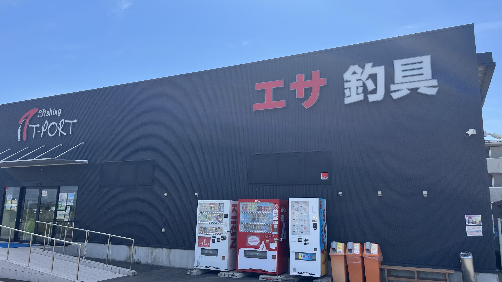
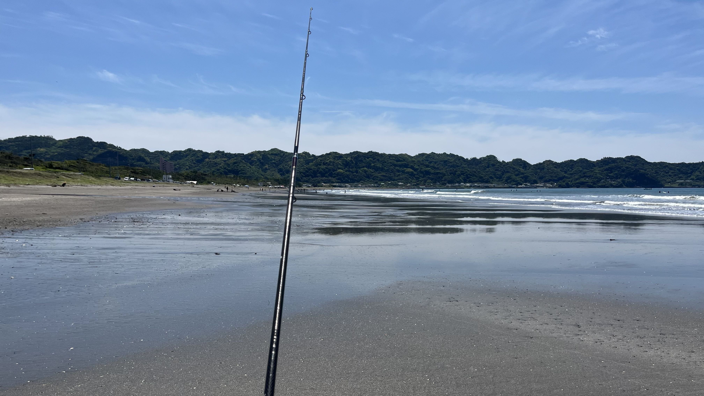
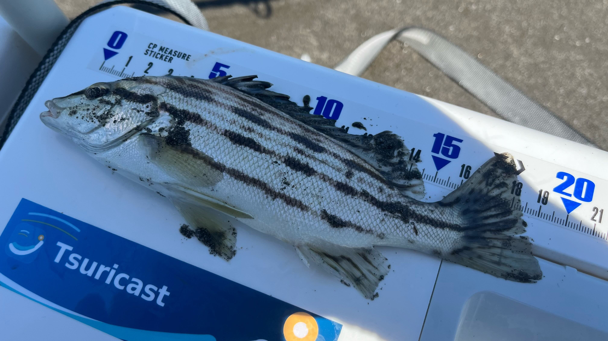
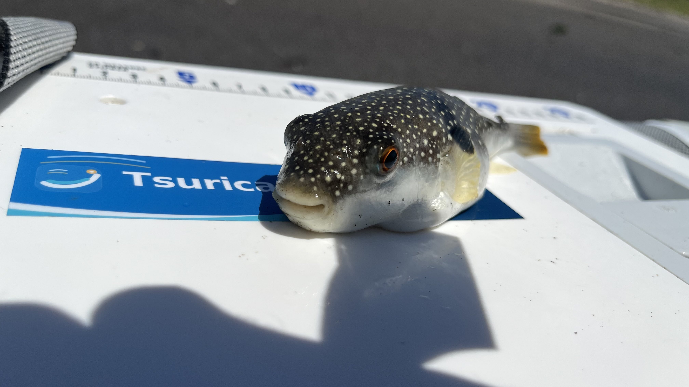
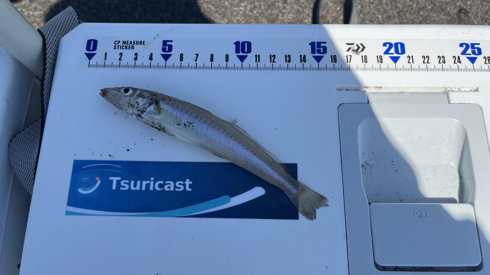
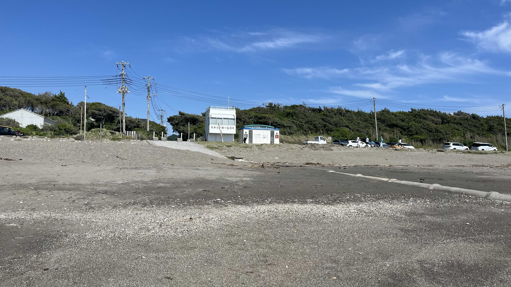
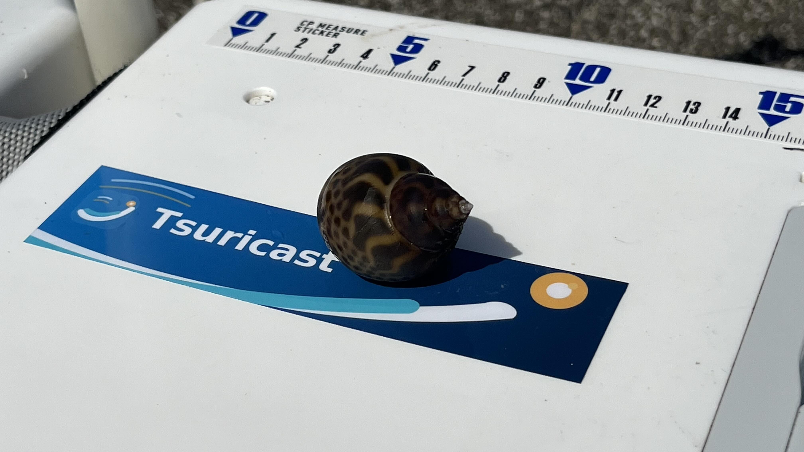
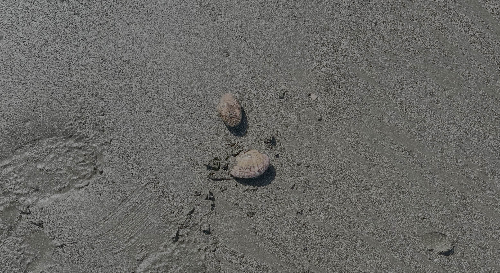

# 【岩井海岸・投げ釣りレポート】アクアライン2時間渋滞を越えた先で女王様のアタリ——GWの内房釣行

## アクアラインが混んでいる。連休だもの。

5:00起床。体力が持てばダブルヘッダーで釣行レポートしようと早起きしました。交通情報アプリを確認すると、6:00の時点でアクアラインに混雑のオレンジが塗られています。

割安料金の時間帯を狙うなら前夜出発するしかありません。今日は普通に料金を払って行くことにします。なお、アクアラインの時間帯別料金は[こちら](https://www.driveplaza.com/etc/dis/etc_dis_aqualine_social_experiment-nextterm/)でご確認ください。

朝のうちは波が残っているのであまり期待できませんが、行きましょう。

-----

## 釣行データ

|項目   |内容                                                              |
|-----|----------------------------------------------------------------|
|釣行日  |2026年5月5日（火・祝）                                                  |
|釣り場  |[岩井海岸](https://tsuricast.jp/chiba/uchibo/minamiboso/iwai-kaigan)|
|天気   |快晴                                                              |
|気温   |18℃                                                             |
|風速・風向|4m/s 北北東                                                        |
|波高   |1m（波周期7s）                                                       |
|潮    |中潮（12:36干潮）                                                     |
|釣果   |シロギス1・コトヒキ1・バイガイ1・フグ複数                                          |

-----

## タックル

- **竿**：ダイワ トーナメントプロキャスターAGS 27-405
- **リール**：ダイワ 17フリーゲン
- **仕掛け**：アスリートキス 4号（50本巻 市販品）
- **エサ**：ジャリメ（[T-PORT木更津金田店](https://t-port.com/shopinfo_aquakaneda/)にて購入）

-----

## 釣行記｜渋滞2時間、でも海は裏切らなかった

### 6:45〜9:15｜アクアライン渋滞との格闘

6:45に出発。7:20には早くも東扇島出口から渋滞。連休だもの、予想はしていました。

8:20の時点でまだ浮島JCTまで1.5km。おなかが空きました。

9:15、ようやくアクアトンネルに入ります。この時点でダブルヘッダーはあきらめました。

9:40、[T-PORT木更津金田店](https://t-port.com/shopinfo_aquakaneda/)でジャリメを購入。ミニストップでおにぎりを調達して少し休憩。ここまででトンネル入口から約2時間。GWのアクアラインはなかなかの強敵です。

### 11:30｜岩井海岸、実釣開始

快晴、気温18℃。気持ちのよい釣り日和です。

干潮が12:36ということもあり、遠浅な岩井海岸は海岸線が60mほど後退し、干潟のような状態になっていました。波は押し寄せるし、潮溜りはできるし、液状化するし。足回りは防水シューズなどで工夫することをおすすめします。

**1投目**、魚信はあるも魚は付かず。たぶんフグでした。

**2投目**、上げてみるとコトヒキ。珍しい顔ぶれです。

**3投目**、3色でいいアタリ。コトヒキかと思いきや——フグでした。

日焼け止めを塗り忘れたことにこの時点で気づきます。フィンガープロテクターのところだけ白いままになるやつですね。気にしません。

### 13:00｜女王様、登場

潮が満ち始め、20歩ほど後退。向かい風に変わり、サーファーも減ってきました。

3色でブルブルっと、あの独特の引き。女王様のアタリです。シロギス、いるじゃないですか。安心しました。

### 13:30｜浜の真ん中へ移動

サーファーが更に減り、浜の真ん中が空いたので移動しました。

竿のしなりに錘がきれいに乗って、素晴らしい飛距離が出ました。毎回こんな感じに投げられたらいいのですが、なかなか再現できません。

そして、必ずしも遠くに魚がいるわけでもない。静かです。何も反応がありません。こういうときは無心でサビき続けます。手前までサビいてみると——バイガイ。お前だけは裏切らないな。

### 15:00｜再び移動

真ん中エリアは魚信がなく、北側の駐車場付近へ移動しました。

途中、生きた貝が掘り起こされているのを発見。貝類には漁業権が設定されていることがあるため、むやみに採取しないようにしましょう。

「キスは足で釣れ」とはよく言いますが、駐車場に近いところで釣れるならそれに越したことはありません。このエリア、実績があるのです。

### 15:20〜15:40｜横風とフグと根掛かり

小さなアタリ。魚信があるだけで幸せです。でもフグでした。ハリス切られました。

15:40、横風が強くなり、お腹も空いてきました。あと一投にしましょう。

注目の最終投の結果は——根掛かり、高切れ！

**15:40、納竿。**

-----

## 釣果

|魚種  |数 |備考  |
|----|--|----|
|シロギス|1 |キープ |
|コトヒキ|1 |キープ |
|バイガイ|1 |リリース|
|フグ  |複数|リリース|

-----

## まとめ｜渋滞2時間、それでも釣りに行く価値はある

アクアトンネルに入るのに5km・2時間の渋滞で、集中力に欠ける釣りになってしまいました。それでも女王様のアタリを1度味わえたので、よしとしましょう。

GW明けに水温がさらに上がれば、岩井海岸のシロギスも本格化してくるはずです。次回は渋滞のない平日に、じっくりと釣り歩いてみたいと思います。

帰りは[道の駅 富楽里とみやま](https://www.furaritomiyama.jp/)に立ち寄ってから帰路につきます。帰りのアクアラインが何時間かかるかは——考えないようにします。

岩井海岸の詳細情報は[Tsuricastのスポットページ](https://tsuricast.jp/chiba/uchibo/minamiboso/iwai-kaigan)でご確認ください。

---

## 葵ちゃんコメント

アクアラインに2時間、トータル5時間かけて、シロギス1尾。1尾あたりの所要時間で言えば今シーズン最高級のキスですね。バイガイに「お前だけは裏切らないな」って語りかけてるの、先輩の孤独が見えます。でも「女王様のアタリ」を味わえたなら、渋滞の2時間分は取り戻せているんだと思います。次は平日に行ってください。​​​​​​​​​​​​​​​​ぜひ。

---

※本記事の情報は釣行時点のものです。釣り場のルールや利用状況は変更される場合があります。現地の看板・案内表示を必ずご確認のうえ、マナーを守ってご利用ください。
